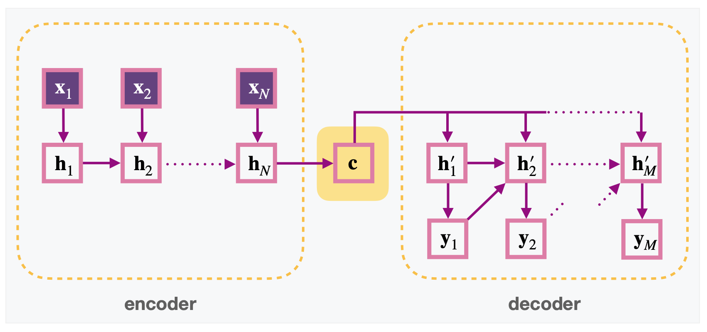
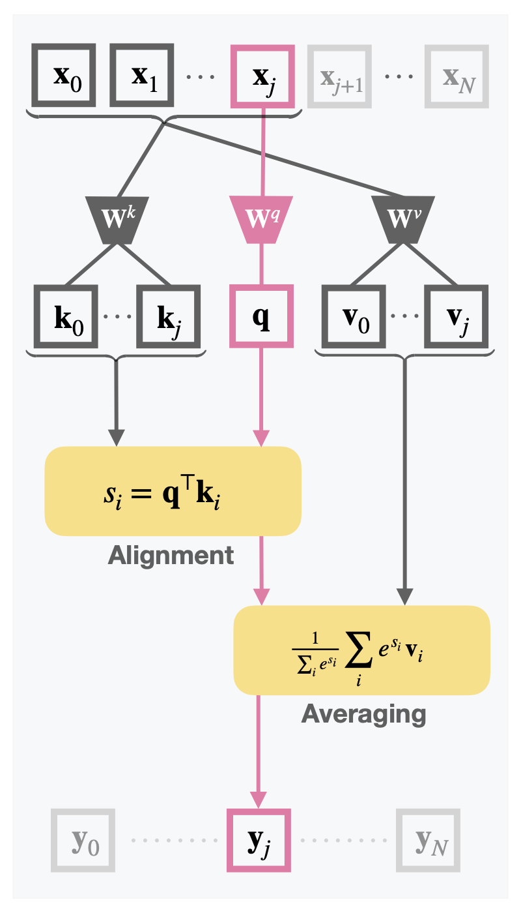
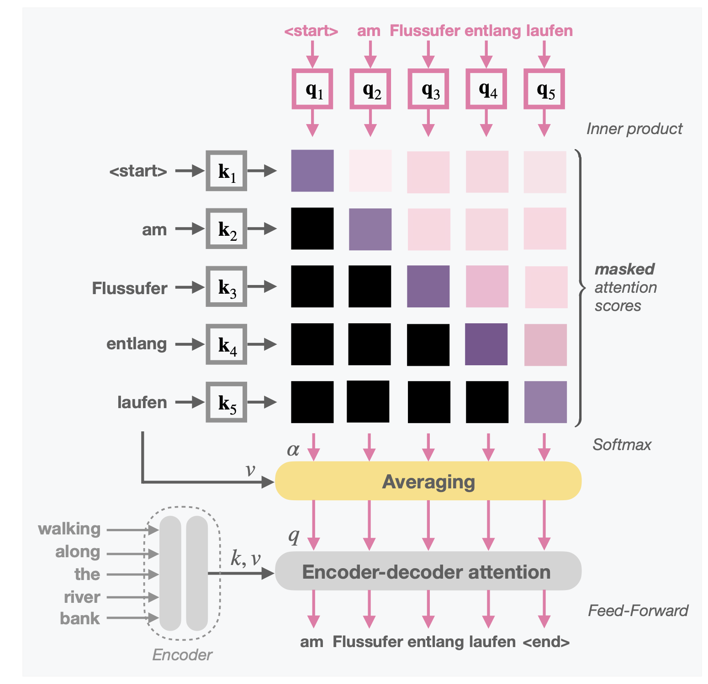
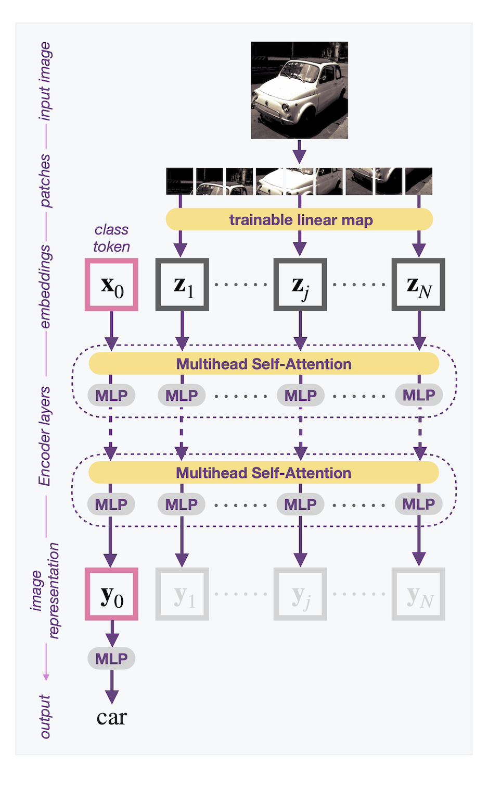
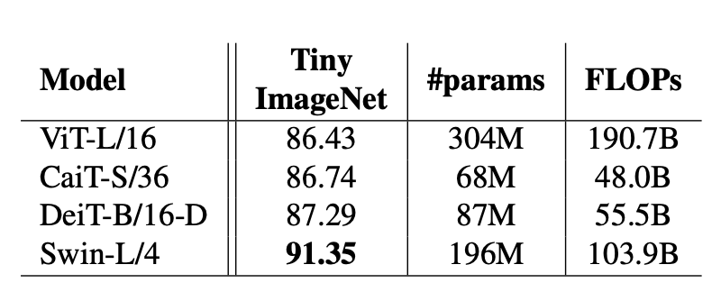

<!-- .slide: data-state="no-toc-progress" -->

Institute of Neural Information Processing | Ulm University

<h1 class="no-toc-progress">Learning with Attention</h1>

Dr. Sebastian Gottwald 

---

## 1. Recurrent Neural Networks (RNNs)

--

### Recap: Supervised learning in feed-forward ANNs

<ul>
<li class="fragment">

**Feed-forward Artificial neural networks** (ANNs) are mappings $f_\theta:\mathcal{X}\to \mathcal{Y}$, from a space of inputs $\mathcal{X}\subset \mathbb{R}^n$ to a space of outputs $\mathcal{Y}\subset \mathbb R^m$, that are explicitly parametrized by a set of so-called **weights** (and biases).

</li>
<li class="fragment">

**Network architecture:** the details of this parametrization, e.g. for a _multi-layer perceptron_ (MLP), $\theta = (W_1,b_1,\dots,W_d,b_d)$, and
$$
f_\theta(x) = f_1(f_2(\cdots f_d(x))),\qquad f_k(x) = \sigma_k(W_k x + b_k)
$$
where $d$ is the number of layers, $(W_k x)_i=\sum_j(W_k)_\{ij\}x_j$, and $\sigma_k:\mathbb R\to\mathbb R$ a non-linear (so-called) **activation** function (sigmoid, tanh, ReLU, etc.) that is applied _componentwise_.

</li>
<li class="fragment">

**Supervised learning:** Given training data $\{(x_i,y_i)\}_{i=1}^N$ of inputs $x_i$ and targets $y_i$, find $\theta$ such that $f_\theta(x_i) \approx y_i$ for all $i=1,\dots,N$, by minimizing a differentiable **loss function** that determines the discrepancy between $f_\theta(x_i)$ and $y_i$ 

</li>
</ul>

<b>Note:</b> We can absorb biases in the weight matrices by assuming that one dimension of $x$, usually the last, is set to $1$.

--

### Restricting feed-forward networks

By various so-called **universal approximation theorems**, fully connected feed-forward ANNs can approximate well-behaved functions between Euclidean spaces arbitrarily well. These theorems **do not specify mechanisms** by which such mappings can be learned efficiently. 

Instead of simply using the most universal fully connected model, in practice it is very valuable (faster and less noisy!) to **choose a more restrictive network architecture that fits the given problem**.  
<!-- .element: class="fragment" -->

**Example**: convolutional neural networks (CNNs) are designed to learn from 2-dimensional data with neighbourhood relationships among the entries, in particular for image recognition.
<!-- .element: class="fragment" -->

Here, we are interested in learning from **sequential data** to perform tasks such as

* **Prediction**: Stock market, weather forecast, ...

* **Sequence transformation**: Language translation, video-to-text, text-to-speech, ...

--

### Sequential data

Consider data, where a **single datapoint consists of a sequence** of items, e.g. a sequence of images (a video), or a sequence of words (a text).

One could represent such datapoints as a single flat vector, but then the network would have to **relearn the original sequential structure** of the data from scratch, e.g. the relationship between the pixels of two subsequent images, or the grouping of letters as words or sentences.
<!-- .element: class="fragment"-->

In general, there are two types of internal dependencies in a sequential datapoint: 

* **Short-range** dependencies, i.e. relationships between subsequent items, e.g., two words that have a high chance of following each other (this is similar to local relationships between pixels in images, and thus could be learned using convolutional networks) 

* **Long-range** dependencies, for example, consider the two sentences "The **animal** didn't cross the street because **it** was too **tired**" and "The animal didn't cross the **street** because **it** was too **wide**." (important for translation into languages like German or French)

--

### $n$-gram models

In theory, if we had a large dataset $\\{\mathbf{x}^1,\mathbf{x}^2,\dots\\}$ of sequences $\mathbf{x}=(x_1,\dots,x_N)$ we could find a probability distribution 
$$
p(\mathbf{X}) = \prod_{k=1}^N p(X_k|X_1,\dots,X_{k-1}).
$$

However, for reasonably large $N$, the amount of datapoints required is unreasonable (the number of terms grows exponentially with $N$). Obvious approximations:

* **Markov assumption**:  $\ p(X_k|X_1,\dots,X_{k-1}) = p(X_k|X_{k-1})$

* **2nd order Markov assumption**: $\ p(X_k|X_1,\dots,X_{k-1}) = p(X_k|X_{k-1},X_{k-2})$

* **n-gram models**: $\ p(X_k|X_1,\dots,X_{k-1}) = p(X_k|X_{k-1},\dots,X_{k-(n-1)})$ 

<b>Note:</b> $n$-gram models are often used for **autocompletion** in searchboxes, e.g. on the web, where the "grams" are usually letters or parts of words.

--

### Basic structure of RNNs

In Hidden Markov Models (HMMs) we have seen another possible solution: track the sequence history using **hidden states**, i.e. in spirit, 
$$
p(X_k|X_1,\dots,X_{k-1}) \approx p(X_k|\text{hidden state}(k))
$$

The same idea applied to neural networks results in RNNs:

* The **task** is to map an input sequence $\mathbf{x}_1,\dots,\mathbf{x}_N$ to an output sequence $\mathbf{y}_1,\dots,\mathbf{y}_N$

* Introduce **hidden states** $\mathbf{h}_1,\dots,\mathbf{h}_N$, where $\mathbf{h}_k$ is a function of the previous state $\mathbf{h}_\{k-1\}$ and the current input $\mathbf{x}_k$, i.e. $$\mathbf{h}_k = f(\mathbf{h}_\{k-1\},\mathbf{x}_k)$$

* Each **output** is a function of the current hidden state, i.e. $\mathbf{y}_k = g(\mathbf{h}_k)$

In particular, $f$ and $g$ do **not** depend on the timestep, but are **shared among all** $k$.

--

### Single-layer RNNs

A single layer RNN is defined by three weight matrices $U,V,W$, s.th.
$$
\mathbf{h}_k = \sigma(U\mathbf{x}_k + W \mathbf{h}_{k-1})
$$ 
and 
$$ 
\mathbf{y}_k = \sigma(V \mathbf{h}_k)
$$
where $\sigma$ denotes a non-linear activation function.

<b>Note:</b> The main difference to a feed-forward network is the **parameter sharing** between the time steps.

--

### Graphical Representations

    
    

    
a <b>single-layer</b> RNN

    
    

    
a <b>multilayer</b> RNN

--

### Example applications of RNNs

<ul>
<li class="fragment">

**Element-wise classification** (symbol-to-symbol mappings), e.g. parts of speech tagging (noun, verb, article, etc..), video frame classification, etc.

</li>
<li class="fragment">

**Sequence generation** (inputs are previous outputs), e.g. generation of music, speech, text, etc. 

</li>
<li class="fragment">

**Conditional sequence generation** (start running the RNN on a given input and then continue with generation), e.g. handwriting generation in a style of a given person, image captioning (e.g. use output of a cnn as initial state)

</li>
<li class="fragment">

**Sequence classification** (sequence as input, only one output), e.g. sentiment analysis, movie classification into genres, etc....

</li>
<li class="fragment">

**Sequence translation** (sequence-to-sequence mappings): need more advanced architectures (later)

</li>
</ul>

--

### Variants of RNNs

Depending on how the layers of a multilayer RNN are connected and how the functions $f$ and $g$ are defined, we obtain 

* Gated Recurrent Units networks (GRUs)

* Long-Short-Term-Memory networks (LSTMs)

* Deep RNNs

and many more. See e.g. the [Dive into Deep Learning](http://d2l.ai/chapter_recurrent-modern/index.html) open source book for an overview.

The listed variants address an important problem of ordinary RNNs that appears during training with gradient descent: **exploding and vanishing gradients**.

--

### Gradients

Irrespective of the choice of the loss function, the derivative 
$$
\frac{\partial (\mathbf{h}_k)_m}{\partial w_\{ij\}} =  \frac{\partial}{\partial w_\{ij\}} \sigma\Big( (U\mathbf{x}_k)_m + \sum_n w_\{mn\} (\mathbf{h}_\{k-1\})_n \Big) \propto \delta_\{im\} (\mathbf{h}_\{k-1\})_j + \sum_n w_\{mn\} \frac{\partial (\mathbf{h}_\{k-1\})_n}{\partial w_\{ij\}}
$$
appears in the update rule for the weight matrix $W=(w_\{ij\})_\{i,j\}$. 

Hence, for the derivative of $\mathbf{h}_k$ we need the derivative of $\mathbf{h}_\{k-1\}$, for which we need the derivative of $\mathbf{h}_\{k-2\}$, and so on. There are two issues with this recurrence relation for large $k$:

* In theory, we would have to calculate the gradients of all previous time steps for every update (in practice the weights are only updated in chunks). 

* More troubling is the factor $w_\{mn\}$ linking the derivative of $\mathbf{h}_k$ and the derivative of $\mathbf{h}_\{k-1\}$, which for large $k$ will blow up if it is larger than $1$ or go to $0$ if it is smaller than one.

---

## 2. Encoder-decoder architectures

--

### Sequence-to-sequence models

While exploding and vanishing gradients can be dealt with by more advanced modules (e.g. LSTMs, GRUs) there are still fundamental **problems with the underlying structure** of the RNNs discussed so far: 

* What if the input and output sequences **do not have the same length**? 

* What if the **order** of input and output sequences are different, e.g. the **start** of the output sequence **depends on the end** of the input sequence? 

**Possible Solution:** Wait until the full sequence has been processed before producing the output sequence. This is known as **encoder-decoder architecture**, originally introduced for language translation, known as _Neural Machine Translation_ (NMT).

<b>Note:</b> Another attempt to solve the issue with processing order are so-called _Bidirectional RNNs_, which contain a forward and a backward pass. 

--

### Basic encoder-decoder architecture

Connect two RNNs serially, **one for reading the input**, and **one for producing the output**: 

* **Encoder:** Calculate hidden states as before, i.e. $\mathbf{h}_k = f_\mathrm{enc}(\mathbf{h}_\{k-1\}, \mathbf{x}_k)$, 

* **Context:** In the basic architecture, the context is simply the last encoder state: $\mathbf{c} = \mathbf{h}_N$

* **Decoder:** Initialize $\mathbf{h}'_1=\mathbf{c}$, for $k>1$ let the previous output be the input to $\mathbf{h}'_k$, i.e. $\mathbf{h}'_k = f_\mathrm{dec}(\mathbf{h}'_\{k-1\},\mathbf{y}_\{k-1\})$, and hidden states produce outputs as usual, i.e. $\mathbf{y}_k = g_\mathrm{dec}(\mathbf{h}'_\{k\})$.

--

##### Encoder-decoder RNN
### Example

The encoder-decoder architecture allows to process full sentences, so that, e.g., when translating "A bird flies through the window" to German, "the" can be correctly translated to "das" (instead of "die" or "der").

**Problem:** The information of each word has to travel through 7 states.
<!-- .element: class="fragment" data-fragment-index="1" -->

    
    

**Solution attempt:** Reverse the order of the input sequence, so that the output sequence can be "unpacked".
<!-- .element: class="fragment" data-fragment-index="2" -->

This is an improvement, but still has **long travel distances** for words at the **end of a sentence** and when the **order of the output is different** from the input.
<!-- .element: class="fragment" data-fragment-index="3" -->

--

### Refinement of encoder-decoder architectures

    
    
    

<!-- 

 -->

**[Sutskever et al. (2014)](https://arxiv.org/abs/1409.3215)**: Basic encoder-decoder architecture
<!-- .element: class="fragment" data-fragment-index="1" -->

**[Cho et al. (2014)](https://arxiv.org/pdf/1406.1078.pdf)**: $\ \mathbf{h}'_k = f_\mathrm{dec}(\mathbf{h}'_\{k-1\},\mathbf{y}_\{k-1\},\mathbf{c})$
<!-- .element: class="fragment" data-fragment-index="2" -->

**[Bahdanau et al. (2015)](https://arxiv.org/pdf/1409.0473.pdf)**: $\ \mathbf{h}'_k = f_\mathrm{dec}(\mathbf{h}'_\{k-1\},\mathbf{y}_\{k-1\},\mathbf{c}_k)$ where $\mathbf{c}_k$ is a function of $\mathbf{h}'_\{k-1\}$ and all encoder states $\mathbf{h}_1,\dots,\mathbf{h}_N$ (and the encoder is bidirectional).
<!-- .element: class="fragment" data-fragment-index="3" -->

<!-- **[Luong et al. (2015)](http://dx.doi.org/10.18653/v1/D15-1166)** -->

--

##### [Bahdanau et al. (2015)](https://arxiv.org/pdf/1409.0473.pdf)
### First encoder-decoder RNN with attention 

    

        
    

    

        
    

--

##### Bahdanau et al. (2015)
### First encoder-decoder RNN with attention 

At step $k$ of decoding:  
<!-- .element: class="fragment" data-fragment-index="1" -->

**Input:** previous decoder state $\mathbf{h'}:=\mathbf{h}'_\{k-1\}$ and all encoder states $\mathbf{h}_1,\dots,\mathbf{h}_N$
<!-- .element: class="fragment" data-fragment-index="1" -->

**Output:** context vector $\mathbf{c}_k$
<!-- .element: class="fragment" data-fragment-index="1" -->

There are two steps:
<!-- .element: class="fragment" data-fragment-index="2" -->

**Alignment:** For each $i$, calculate a similarity score between $\mathbf{h}_i$ and $\mathbf{h}'$ using an _alignment model_ $a$, represented by a separate feed-forward neural network, and define $\alpha_\{i\} = \mathrm{softmax}_i(a(\mathbf{h}_i,\mathbf{h}'))$
<!-- .element: class="fragment" data-fragment-index="2" -->

**Averaging:** $\mathbf{c}_k = \sum_i \alpha_\{i\} \mathbf{h}_i$
<!-- .element: class="fragment" data-fragment-index="3" -->

        
        
        
        
    

--

### Attention in RNNs

To summarize the attention mechanism discussed so far:

* attention is a **soft selection mechanism** 

* it uses a **similarity measure** to compare vectors of two sets, a set of **query vectors** (e.g. the decoder states $\mathbf{h}'$) and a set of **value vectors** (e.g. the encoder states $\mathbf{h}$)

* a given **query vector is compared to all value vectors** using the similarity measure

* the softmax of the result of this comparison is then used to take the **weighted average of the value vectors**

**Extreme cases:**

* If the two sets are identical, consisting of vectors $\mathbf{h}_1,\dots,\mathbf{h}_N$, then for any reasonable similarity measure $a$ and any fixed $k$, $\alpha_\{j\} = \mathrm{softmax}_j(a(\mathbf{h}_j,\mathbf{h}_k))$ will be peaked around $j=k$, so that the weighted average wrt. $\alpha$ will more or less retrieve $\mathbf{h}_k$.

* If the similarity measure $a$ cannot detect differences between the two sets of vectors so that all $a(\mathbf{h},\mathbf{h}')$ are the same, then the weighted average is the arithmetic mean. 

--

### Remaining issues

* **RNNs are slow**, since they need to process the input sequence **vector by vector**, in particular they cannot be parallelized well.

* In case of longer sequences, the discussed **attention mechanism is slow**: the calculation of the alignment scores
$$
s_\{ij\} = a(\mathbf{h}_i,\mathbf{h}_j') \qquad\forall i \in \\{1,\dots N\\}, \ \forall j \in \\{1,\dots,M\\}
$$ 
requires $N\cdot M$ evaluations of the corresponding neural network. 

$\Longrightarrow$ both of these issues are solved (partly) by the networks in the next section. 

---

## 3. Transformers

--

### Dot-Product Attention

Instead of evaluating the attention network $N\cdot M$ times to calculate the scores 
$$
s_\{ij\} = a(\mathbf{h}_i,\mathbf{h}_j') \qquad\forall i \in \\{1,\dots N\\}, \ \forall j \in \\{1,\dots,M\\},
$$ 
in the attention mechanism popularized by [Vaswani et al. (2017)](https://papers.nips.cc/paper/2017/file/3f5ee243547dee91fbd053c1c4a845aa-Paper.pdf) this is simplified to
$$
s_\{ij\} = f(\mathbf{h}_i) \cdot g(\mathbf{h}'_j) \qquad\forall i \in \\{1,\dots N\\}, \ \forall j \in \\{1,\dots,M\\}
$$
so that the number of evaluations reduces to $N+M$, followed by an inner product. 
<!-- .element: class="fragment" -->

The functions $f$ and $g$ could, e.g., be two neural networks with the same output dimensions, or in the simplest case, taken to be identities $f=g=id$ (see e.g. [Luong et al. (2015)](http://dx.doi.org/10.18653/v1/D15-1166)).
<!-- .element: class="fragment" -->

In **Query-Key-Value attention** ([Vaswani et al. (2017)](https://papers.nips.cc/paper/2017/file/3f5ee243547dee91fbd053c1c4a845aa-Paper.pdf)), $\ f$ and $g$ are learnable linear maps. 
<!-- .element: class="fragment" -->

--

### Query-Key-Value mechanism

**Inputs:** $\mathbf{x}_1,\dots,\mathbf{x}_N$ and $\mathbf{z}_1,\dots,\mathbf{z}_M$

**Outputs:** $\mathbf{y}_1,\dots,\mathbf{y}_M$

**Learnable weight matrices:** $\mathbf{W}^q$, $\mathbf{W}^k$, $\mathbf{W}^v$

The vectors $\mathbf{x}_i$ are transformed to **keys** $\mathbf{k}_i := \mathbf{W}^k \mathbf{x}_i$ and **values** $\mathbf{v}_i := \mathbf{W}^v \mathbf{x}_i$, while $\mathbf{z}_j$ are transformed to **queries** $\mathbf{q}_j := \mathbf{W}^q \mathbf{z}_j$.

For each query $\mathbf{q}:=\mathbf{q}_j\in \\{\mathbf{q}_1,\dots,\mathbf{q}_M\\}$, 

* calculate the **similarity scores** $s_i = \mathbf{q}^\top \mathbf{k}_i$

* and take the **weighted average** of the values $\mathbf{v}_i$ with respect to $$\alpha_i := \mathrm{softmax}_i (s_i)$$ resulting in $\mathbf{y}_j := \sum_i \alpha_i \mathbf{v}_i$.

        

--

##### Query-Key-Value mechanism
### Comments

<ul>
<li class="fragment"> 

Often, we assume that $\mathbf{W}^k=\mathbf{W}^v$, so that the keys and values are identical sets.

</li>

<li class="fragment">

For NLP, the input vectors are **learned word embeddings** (using available algorithms such as word2vec), usually high-dimensional, e.g., $d_\text\{embedding\} = 512$.

</li>

<li class="fragment">

The target dimension of $\mathbf{W}^q$, $\mathbf{W}^k$ and $\mathbf{W}^v$ is usually much smaller, so that the corresponding mappings can be thought of "projections" to a lower dimensional feature space. 

</li>

<li class="fragment">

There are usually **multiple attention heads**, copies of the attention mechanism with different weights, focussing on **different features** (total output = concat(head outputs)).

For example, one head for semantic features (e.g. words that determine the topic) and one for grammatical features (e.g. subject). 

</li>
</ul>

    

<!-- 
<li class="fragment"> 

Considering the elements $\mathbf{x}_i$, $\mathbf{z}_i$ of the input sequences as random variables $\mathbf{X}$, $\mathbf{Z}$, then the output $\mathbf{y}_j$ is the conditional expectation of $\mathbf{W}^v \mathbf{X}$, 
$$
\mathbf{y}_j(\mathbf{x}_1,\dots,\mathbf{x}_N,\mathbf{z}_j) = \sum\nolimits_i p_\{\mathbf{W}^q,\mathbf{W}^k\}\big(\mathbf{X} = \mathbf{x}_i| \mathbf{Z}=\mathbf{z}_j\big) \mathbf{W}^v \mathbf{x}_i = \mathbb E_\{\mathbf{W}^q,\mathbf{W}^k\}\big[\mathbf{W}^v \mathbf{X} \big| \mathbf{Z} = \mathbf{z}_j\big]
$$
under the probability over elements $\mathbf{X}\in \\{\mathbf{x}_1,\dots,\mathbf{x}_N\\}$ conditioned on $\mathbf{Z}=\mathbf{z}_j$, given by the softmax

$$
p_\{\mathbf{W}^q,\mathbf{W}^k\}\big(\mathbf{X} = \mathbf{x}_i| \mathbf{Z}=\mathbf{z}_j\big) = \frac{e^\{\mathbf{q}_j^\top \mathbf{k}_i\}}{\sum_k e^\{\mathbf{q}_j^\top \mathbf{k}_k\}} = \frac{e^\{(\mathbf{W}^q\mathbf{z}_j)^\top \mathbf{W}^k \mathbf{x}_i\}}{\sum_k e^\{(\mathbf{W}^q\mathbf{z}_j)^\top \mathbf{W}^k \mathbf{x}_k\}}
$$
which is simply a probability distribution parametrized by $\mathbf{W}^q$ and $\mathbf{W}^k$, peaked at those $i$ for which the **keys** $\mathbf{W}^k\mathbf{x}_i$ are **aligned well** with the **query** $\mathbf{W}^q\mathbf{z}_j$ (high inner product!).

</li> -->

--

##### [Vaswani et al. (2017)](https://papers.nips.cc/paper/2017/file/3f5ee243547dee91fbd053c1c4a845aa-Paper.pdf)
### Attention is all you need

The basic transformer architecture contains two different types of query-key-value attention:

* **Self-Attention** and **Masked Self-Attention**

* **Encoder-Decoder (Cross-)Attention**

which differ in how the two input sequences $(\mathbf{x}_1,\dots,\mathbf{x}_N)$ and $(\mathbf{z}_1,\dots,\mathbf{z}_M)$ are chosen.

**Note:** There are often **multiple encoder and decoder layers**, as well as **multiple attention heads** per layer.

    

--

### Self-Attention

**Query-Key-Value attention with $\mathbf{z}_j = \mathbf{x}_j \ \forall j$**.

That is, all three components, queries, keys, and values, result from the same input vectors $\mathbf{x}_1,\dots,\mathbf{x}_N$ through the transformations $\mathbf{W}^q$, $\mathbf{W}^k$, and $\mathbf{W}^v$.

<ul>
<li class="fragment">

Each (transformed) input vector can attend to any of the other input vectors to build a **combined representation** or an **abstraction**.

</li>

<li class="fragment">

In a multihead self-attention block, each head can focus on forming abstractions of **different features**.

</li>

<li class="fragment">

Using **multiple layers** of self-attention blocks, abstractions can attend to other abstractions.

</li>
</ul>

<b>Note:</b> This is similar to convolutional neural networks but without being restricted to the local neighbourhood!

    

--

##### Self-Attention
### Example

An exemplary attention head where "river bank" forms a <b>combined representation</b>

--

### Encoder-decoder attention

**Query-Key-Value attention** where

* **keys and values** come from the final output of the encoder

* **queries** originate from the self-attention output of the decoder.

This way, the decoder can attend to the outputs of the encoder.

Again, multiple attention heads allow to consider different feature spaces.

<b>Note:</b> This is the only connection between encoder and decoder ("Attention is all you need!").

    

--

### Masked Self-Attention

Self-Attention where **each word can only attend to words in the past**. 

In particular,

* positions are offset by one entry

* the attention scores $s_{ij}$ are masked so that positions are not allowed to attend to subsequent positions

Combined, this means that predictions for position $k$ can only depend on known outputs at positions less than $k$

**Note:** Without the masking, the decoder self-attention would simply look ahead to the next symbol during training and be useless for prediction.

    

--

##### Masked Self-Attention
### Prediction

Third step of translating "walking along the river bank" to German. The <b>encoder is only executed once</b>,  reading the input sequence in parallel, while the <b>decoder outputs word by word</b>.

--

##### [Williams, Zipser (1989)](https://doi.org/10.1162/neco.1989.1.2.270)
### Teacher forcing in RNNs

_In short:_ **Use ground truth as input** instead of the model output of the previous time step.

A strategy already used to train RNNs as an alternative to backpropagation through time.

Instead of using the previous-output-as-input scheme of RNNs during training, one uses the actual training data as input to the next state (and not only to define the error at the end).   

$\Rightarrow$ Learning is more stable, since the model **is not punished for consequential errors** (only once for each error).

$\Rightarrow$ Training can be **parallelized over the sequence**, since we do not have to wait for the output of the previous step before computing the current step.

**Analogy:** Learning a song by singing while listening to it (instead of singing it from memory).

--

##### Masked Self-attention
### Training

Using **teacher forcing**, the decoder can be **parallelized during learning** like the encoder:

* Regular self-attention on shifted output sequence.

* Masking the upper diagonal of the attention scores with $-10^9$ before the softmax is applied.

    

--

### Some additional details

There are some components of the Transformer architecture that we did not discuss so far:

**Scaled dot-product**: Divide $\mathbf{q}^\top \mathbf{k}$ by $\sqrt{d}$ where $d =$ dimension of keys and queries.
<!-- .element: class="fragment" -->

**Positional encoding**: There is no learnable positional information in the attention mechanism discussed so far. Thus one has to add some type of positional encoding to the embeddings, e.g. sine and cosine with frequencies that depend on the position.   
<!-- .element: class="fragment" -->

**Residual connections**: There are residual connections between inputs and outputs of each attention layer.
<!-- .element: class="fragment" -->

**Layer Normalization** ([Lei Ba, Kiros, Hinton (2016)](https://arxiv.org/pdf/1607.06450.pdf)): Normalize over the units in a layer by shifting and rescaling.
<!-- .element: class="fragment" -->

**Final softmax layer**: The final layer of the Transformer architecture consists of a fully connected layer followed by a **softmax over all words** in the respective vocabulary.
<!-- .element: class="fragment" -->

--

### Machine Translation Results

Image taken from <a target="_blank" rel="noopener noreferrer" href="https://papers.nips.cc/paper/2017/file/3f5ee243547dee91fbd053c1c4a845aa-Paper.pdf">Vaswani et al. (2017)</a> (human translators reach BLEU scores of ~30 for EN-DE)

--

### Applications to other tasks

#### Vision 

* Mixing CNNs with self-attention: [Wang et al. (2018)](https://arxiv.org/abs/1711.07971), [Carion et al. (2020)](https://arxiv.org/abs/2005.12872)

* **Vision Transformer** (ViT): [Dosovitskiy et al. (2020)](https://arxiv.org/abs/2010.11929)

* **Perceiver**: [Jaegle et al. (2021)](https://arxiv.org/abs/2103.03206)

...and many more

#### Full Language Models

* **BERT**: [Devlin et al. (2019)](https://arxiv.org/abs/1810.04805) (110 million parameters)

* **GPT-3**: [Brown et al. (2020)](https://arxiv.org/abs/2005.14165) (31 authors, 175 billion parameters)

#### Reinforcement learning

<ul>

<li>

**Decision transformer**: [Chen et al. (2021)](https://arxiv.org/abs/2106.01345)

</li>

</ul>

--

### Performance issue of Transformers

Transformers are a large improvement over traditional RNNs, in particular due to the parallelization of learning and the ability to efficiently attend to arbitrary elements of a sequence.

However, in the standard transformer, a **very large sequence length** $N$ is still a problem (e.g. training a network to summarize articles, or when applied to vision). The culprit is the attention mechanism:

* Original attention in RNNs: calculate $a(\mathbf{h}_i,\mathbf{h}_j)$ $\forall i,j=1,\dots,N$, where $a$ is an ANN

* Query-Key-Value attention: calculate $\mathbf{q}_j^\top \mathbf{k}_i$ $\forall i,j=1,\dots,N$, 

In most cases, Query-Key-Value attention is much faster than the original approach since the evaluation of a neural network is replaced by the linear operations $\mathbf{W}^k\mathbf{x}$, $\mathbf{W}^q\mathbf{x}$ and the inner product.

But the issue is that every element is still allowed to attend to any other element, which is an **everyone-with-everyone** operation that scales **quadratically with sequence length**.

--

### Recent Proposals to deal with quadratic costs

* **[Reformer (2020)](https://openreview.net/pdf?id=rkgNKkHtvB)**: More efficient transformers using several tricks to achieve $\mathcal O(N\log N)$.

* **[LINformer (2020)](https://arxiv.org/abs/2006.04768)**: Linear complexity by projecting keys and values to lower dimensions. 

* **[Performer (2020)](https://arxiv.org/abs/2009.14794)**: Linearize and approximate the softmax of the attention scores using kernels. Beats the LINformer and Reformer while still scaling linearly.

* **[Perceiver (2021)](https://arxiv.org/abs/2103.03206)**: Linear complexity by using cross-attention where queries come from a latent array of a fixed size, resulting in a fixed bottleneck independent of input size.

* **[Shared Workspace (2021)](https://arxiv.org/abs/2103.01197)**: Use two attention mechanisms to communicate through a shared workspace, also creating a bottleneck. 

Even more recently, models got rid of the attention mechanism as well, only keeping the mixing of tokens and were shown to be similarly successful:

* **[MLP-Mixer (2021)](https://arxiv.org/abs/2105.01601)**: There are two type of MLP-layers, one applied to image patches (mixing per-location features), and one applied accross patches (mixing spatial information).

* **[FNET (2021)](https://arxiv.org/abs/2105.03824)**: Replace self-attention by a linear mixing algorithm using Fourier transforms. Achieves 92-97% accuracy, but is 70-80% faster.

---

## 4. Vision Transformers

--

##### [Dosovitskiy et al. (2021)](https://arxiv.org/abs/2010.11929)
### An image is worth 16x16 words
The original Vision Transformer (ViT).

<ul>
<li>

Follows **encoder architecture** of the original transformer ([Vaswani2017](https://arxiv.org/abs/1706.03762))

</li>
<li class="fragment">

Image is split into a fixed number of **non-overlapping patches**

</li>
<li class="fragment">

Flattened patches are **embedded by a learnable linear map**

</li>
<li class="fragment">

An extra **class token** (such as in BERT) is used to represent the full image, whose final state is used as input for a shallow MLP mapping to the corresponding class.

</li>
</ul>

**Note:**  As usual, there are also residual connections, layer normalization, and positional (1d) encoding.

    

--

##### [Dosovitskiy et al. (2021)](https://arxiv.org/abs/2010.11929)
### An image is worth 16x16 words

Image source: <a target="_blank" rel="noopener noreferrer" href="https://openreview.net/pdf?id=YicbFdNTTy">Dosovitskiy et al. (2021)</a>

<ul>
<li>

**competitive** with or better than CNNs  (current state of the art on ImageNet-1k with **88.55%** top-1-accuracy)

</li>
<li>

**BUT**: pre-trained on a **huge dataset** (e.g. JFT-300M, available internally at Google)

</li>
</ul>

<ul>
<li class="fragment">

**reason**: there is no locality inherent to transformers (in contrast to CNNs)

</li>
<li class="fragment">

The authors summarize this by "_We find that large scale training trumps inductive bias_" and conclude that transformers "_do not generalize well when trained on insufficient amounts of data_".

</li>
</ul>

--

##### [Touvron et al., 2021](https://arxiv.org/abs/2012.12877)
### data-efficient image transformers

Image source: <a target="_blank" rel="noopener noreferrer" href="https://arxiv.org/abs/2012.12877">Touvron et al., 2021</a>

Direct training on ImageNet **without pre-training on a larger dataset** using a specific training procedure (~2-3 days on a 4-8 GPU node, competitive to current CNNs):

<ul>
<li class='fragment'>

initialize weights with a **truncated normal distribution** (transformers are sensitive to initialization)

</li>
<li class="fragment">

**stochastic depth**: randomly drop a subset of layers during training, replacing them with identity mappings

</li>
<li class="fragment">

**label smoothing**: calculate the cross-entropy loss using a weighted mixture of the hard targets with the uniform distribution

</li>
<li class="fragment">

**fine-tuning at different resolution**: train with resolution 224x224 and fine-tune with resolution 384x384 

</li>
<li class="fragment">

various **data augmentation** methods (see next slide) 

</li>
</ul>

--

##### [Touvron et al., 2021](https://arxiv.org/abs/2012.12877)
### data-efficient image transformers
The following augmentation methods proved to be useful for vision transformers:

* [batch augmentation](https://openaccess.thecvf.com/content_CVPR_2020/papers/Hoffer_Augment_Your_Batch_Improving_Generalization_Through_Instance_Repetition_CVPR_2020_paper.pdf): apply multiple augmentations to the same image

*  [RandAugment](https://arxiv.org/abs/1909.13719): simplified automatic augmentation method performing a grid-search over augmentation parameters: **magnitude** of each augmentation, the **amount of augmentations** per image, and the amount of **available augmentations** (e.g. rotation, contrast, color, etc.). 

* Out-of-distribution augmentations:

    * [mixup](https://arxiv.org/pdf/1710.09412.pdf): convex combination of raw inputs and one-hot encoded outputs

    * [random erasing](https://arxiv.org/pdf/1708.04896.pdf)/[cutout](https://arxiv.org/pdf/1708.04552.pdf): cut out a random part of an image

    * [cutmix](https://arxiv.org/pdf/1905.04899.pdf): image patches are cut and pasted in other images with mixed output labels proportional to the relative patch sizes

    

    

    
Image source: <a target="_blank" rel="noopener noreferrer" href="https://arxiv.org/pdf/1905.04899.pdf">Yun et al., 2019</a>

--

##### [Touvron et al., 2021](https://arxiv.org/abs/2012.12877)
### data-efficient image transformers

<ul>
<li>

Also introduced a new **token-based distillation method** that boosts performance, especially of smaller image transformers

</li>
<li class="fragment">

However, the <b>influential contribution</b> was the training scheme that was adopted by multiple follow-up papers, that established new start-of-the-art performances. For example:

<ul>
<li>

[Touvron et al., 2021](https://arxiv.org/abs/2103.17239), _Class-Attention in Image Transformers (CaiT)_: **inserts the class token** at a later layer after **freezing** the patch embeddings. 

</li>
<li>

[Liu et al., 2021](https://arxiv.org/abs/2103.14030), _Swin Transformer_: **hierarchical shifted** (not _sliding_) **window** approach to self-attention with **linear complexity** (see next slides)

</li>
</ul>
</li>
</ul>

        

Top-1-accuracy on ImageNet-1k (source: <a target="_blank" rel="noopener noreferrer" href="https://arxiv.org/abs/2012.12877">Touvron et al., 2021</a>)

--

##### [Liu et al. (2021)](https://arxiv.org/abs/2103.14030)
### Swin Transformer

Essentially consists of 3 modifications of ViT:

<ol>
<li>

**Hierarchical structure**: multiple "stages", groups of layers that merge neighbouring tokens of previous groups  $\Rightarrow$ locality bias

</li>
<li class="fragment">

Each stage contains multiple layers with **local self-attention inside of fixed-size windows**  $\Rightarrow$ linear complexity (+ more locality)

</li>
<li class="fragment">

each local self-attention layer is always followed by a **shifted window** self-attention layer  $\Rightarrow$ communication between neighbouring patches of previous block

</li>
</ol>

    

    

--

##### [Liu et al. (2021)](https://arxiv.org/abs/2103.14030): Swin Transformer
### Hierarchical Structure

    

<b>Parameter settings in <a target="_blank" rel="noopener noreferrer" href="https://arxiv.org/abs/2103.14030">Liu et al., 2021</a>:</b> input size $(H,W)=$ (224,224), 3 channels (RGB), patch size (4,4), mapped to 
$C\in \{96,128,192\}$ dimensional embedding (tiny, small, etc.), 4 stages, downsampling by (2x2) between stages with doubling of embedding size, multiple windowed multihead self-attention layers per stage (see next slide)

--

##### [Liu et al. (2021)](https://arxiv.org/abs/2103.14030): Swin Transformer
### Local windowed Self-Attention in each stage

    

<b>Parameter settings in <a target="_blank" rel="noopener noreferrer" href="https://arxiv.org/abs/2103.14030">Liu et al., 2021</a>:</b> Window-size $M$ = 7, window shift $\lfloor {M}/{2} \rfloor$ (= 3), layers per stage = (2,2,6,2) and (2,2,18,2) for larger models, fixed number of attention per stage, e.g. (3,6,12,24) for smaller models.

--

##### [Liu et al. (2021)](https://arxiv.org/abs/2103.14030): Swin Transformer
### remarks

<ul>
<li class="fragment">

Boundary windows that do not fit the image are combined (instead of extra padding; same number of windows as non-shifted).

</li>

<li class="fragment">

Positional information is encoded in a bias term added to the attention scores inside the softmax (similar to [T5](https://arxiv.org/pdf/1910.10683.pdf), [LeViT](https://arxiv.org/pdf/2104.01136.pdf), etc.)

</li>
</ul>

    

    

    

    
Image source: <a target="_blank" rel="noopener noreferrer" href="https://arxiv.org/pdf/2205.10660v1.pdf
">Huynh (2022)</a>

<ul>
<li class="fragment">

Merging between stages $\approx$ self-attention layers with neighbourhoods forced to have the same embeddings, i.e. **Swin vs ViT** $\approx$ **FFNs vs CNNs** (similar approach: [LeViT](https://arxiv.org/pdf/2104.01136.pdf)) 

</li>
<li class="fragment">

**Improvements**:

<ul>
<li>

[Swin transformer v2](https://arxiv.org/pdf/2111.09883.pdf): Technical modifications for better scaling.

</li>
<li>

[VOLO](https://arxiv.org/abs/2106.13112): Extra preprocessing stage that creates fine-level token representations.

</li>
<li>

[HAT](https://arxiv.org/abs/2204.00993): Low ViT performance is attributed to high-frequency Fourier components (e.g. sharp edges). Augmenting specifically those components improves performance.

</li>
</ul>
</li>
</ul>

--

# Thank you!

