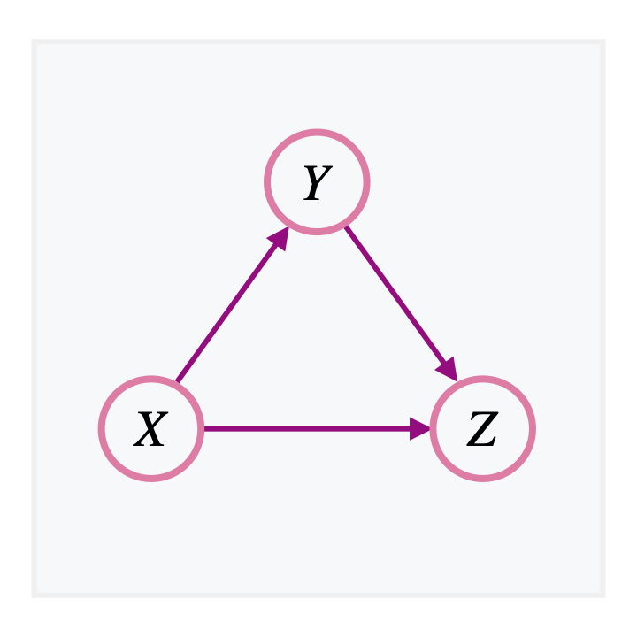

<!-- .slide: data-state="no-toc-progress" -->

Institute of Neural Information Processing | Ulm University

<h1 class="no-toc-progress">Learning in Graphical Models</h1>

Dr. Sebastian Gottwald 

---

## Recap: Probability calculus

--

### Probability distributions in one dimension

For a finite set $\Omega=\\{\omega_1,\dots,\omega_N\\}$, we call any function $p:\Omega\to[0,1]$ with the property 
$$
\sum\nolimits_{i=1}^N p(\omega_i) = 1
$$ 
a __probability distribution__ on $\Omega$, and $p(\omega)$ is the _probability of_ $\omega\in\Omega$.  

Similarly, any non-negative function $f:\mathbb R\to\mathbb R_+$ with $\int_{\mathbb R} f(x) \ dx = 1$ is called a __probability density__  on $\mathbb R$, where for any subset $A\subset \mathbb R$, the integral $p(A):= \int_A f(x) \ dx$ is the probability of $A$. 

Examples:
* $p(\omega) = \frac{1}{N}$ for all $\omega\in\\{\omega_1,\dots,\omega_N\\}$ (_uniform_ distribution)
* $p(\omega) = \delta_{\omega,\omega_0}$ for some fixed $\omega_0\in\\{\omega_1,\dots,\omega_N\\}$ (_Dirac_ distribution)
* $f(x) = \frac{1}{\sqrt{2\pi \sigma^2}} e^{-(x-\mu)^2/(2\sigma^2)}$ (_Gaussian_ density)
* $f(x) = \lambda e^{-\lambda x}$ for all $x\geq 0$, $\lambda >0$ (_Exponential_ density)

<b>Note:</b> For distributions on countable sets $\Omega=\{\omega_1,\omega_2,\dots\}$, one also writes $p_i:=p(\omega_i)$ for all $i$.

--

### Probability distributions in multiple dimensions

Probability distributions on cartesian products $\Omega^n = \Omega\times \cdots \times \Omega$ of a finite set $\Omega$ are functions $p:\Omega^n\to [0,1]$ such that $\sum_{i,\dots,j} p(\omega_i,\dots,\omega_j)=1$ (and analogously for products of differing sets), also known as __multivariate distributions__.

Similarly, __multivariate probability densities__ $\ f$ are probability densities on $\mathbb R^d$, i.e. $f:\mathbb R^d\to \mathbb R_+$ such that $\int_{\mathbb R^d} f(x_1,\dots,x_d) \ dx^d = 1$.

Examples:
* $p(\omega,\omega') = \frac{1}{N^2}$ where $N = |\Omega|$ (_uniform distribution on_ $\Omega\times\Omega$)
* $p(\omega,\omega') = p_1(\omega)p_2(\omega')$ (_products_ of one-dimensional distributions $p_1,p_2$)
* $p(\mathbf{n}) = \frac{(\sum_{i=1}^k n_i){!}}{n_1!\cdots n_k!} p_1^{n_1}\cdots p_k^{n_k}$ for $\mathbf{n} = (n_1,\dots,n_k) \in \mathbb N^k$ (_Multinomial distribution_)
* $f(\mathbf{x}) = \frac{1}{\sqrt{(2\pi)^d \mathrm{det}(\Sigma)}} e^{-(\mathbf{x} - \mathbf{\mu})\Sigma^{-1}(\mathbf{x} - \mathbf{\mu})/2}$ for $\mathbf{x}=(x_1,\dots,x_d)\in\mathbb R^d$  (_Multivariate Gaussian_) 

--

### Generalization: Probability measure

Consider the example of rolling a die with uniform probability $p(\omega) = \frac{1}{6}$ for all $\omega\in \Omega=\\{1,\dots,6\\}$. What is the probability of rolling an even number? 

Since there are only two possibilities, even and odd, with equal counts, it is intuitively obvious that $\mathrm{Prob}(\mathrm{even}) = \frac{1}{2}$. But how would we calculate it in situations where we do not have an intuition? 

Any probability distribution is an instance of a __probability measure__ $\mathbb P$, which, by definition, maps sets $A$ to numbers $\mathbb P(A)$ between $0$ and $1$, with the extra property that
$$
\mathbb P\Big(\bigcup_i A_i\Big) = \sum_i \mathbb P(A_i) 
$$
for any family of disjoint sets $A_i$.

Therefore, since $\mathrm{even} = \\{2,4,6\\} = \\{2\\} \cup \\{4\\} \cup \\{6\\}$, we have
$$
p(\mathrm{even}) = p(2) + p(4) + p(6) = \tfrac{3}{6} = \tfrac{1}{2}
$$

--

### Random experiments

A __random experiment__ is a trial with unknown outcome. The collection of all possible outcomes of such an experiment is called a __sample space__, often denoted by the letter $\Omega$.

For example:

* _Tossing a coin:_ $\ \Omega = \\{\mathrm{heads},\mathrm{tails}\\}$

* _Rolling a die:_ $\ \Omega = \\{1,2,3,4,5,6\\}$

* _Pick a card from a deck of $52$ cards:_ $\ \Omega=\\{\text{ace of clubs},\dots, \text{king of spades}\\}$.

* _Observe the number of electric cars sold in a day:_ $\ \Omega = \mathbb N$

--

### Events

An event is a __subset $A\subset \Omega$ of a sample space__ $\Omega$, i.e. a set of possible outcomes of a random experiment.

For example:

* $A=$ "the coin toss yields heads" $=$ $\\{\mathrm{heads}\\}$

* $A=$ "the die shows an even number" $= \\{ 2,4,6\\}$

* $A=$ "the card is red" $= \\{\text{ace of diamonds}, \dots, \text{king of hearts}\\}$ (26 cards)

* $A=$ "the number of electric cars sold in a day is between 50 and 100" $= \\{50,\dots,100\\}$

The set of all allowed events (a so-called [_sigma algebra_](https://en.wikipedia.org/wiki/Σ-algebra)) is usually denoted by $\Sigma$. A common example is the __power set__ $2^\Omega$, i.e. the set of all subsets of $\Omega$. 

--

### Probability space

A probability space is a triple $(\Omega, \Sigma, \mathbb P)$, consisting of a __sample space__ $\Omega$, a __set of events__ $\Sigma$, and a __probability measure__ $\mathbb P$, assigning probabilities $\mathbb P(A)$ to all events $A\in \Sigma$.

For example:

* _Rolling a die:_ $(\Omega, \Sigma, \mathbb P) = (\\{1,\dots,6\\}, 2^{\\{1,\dots,6\\}}, \mathbb P)$, where $\mathbb P(\{\omega\}) = \frac{1}{6}$ $\forall \omega=1,\dots,6$.

* _Tossing a biased coin twice:_ $(\Omega,\Sigma,\mathbb P)$ with $\Omega = \\{ HH, HT, TH, TT \\}$,
$$
\Sigma = \\{ \emptyset, \\{HH\\}, \dots, \\{TT\\}, \\{HH, HT\\}, \dots, \\{ TH,TT \\}, \\{HH, HT, TH\\},\dots, \Omega \\}
$$
and for $\omega = (\omega_0,\omega_1)$ with $\omega_i\in \\{H,T\\}$, we have $\mathbb P(\omega) = p(\omega_0)\cdot p(\omega_1)$, where $p$  is the probability distribution over $\\{H,T\\}$, given by $p(H) = b$ and $p(T)=1-b$ for some bias $b\in[0,1]$. 

<b>Note:</b> For the rest of the lecture, we always assume that a sample space $\Omega$ is part of a given probability space with probability measure $\mathbb P$ even if we do not explicitly mention it. 

--

### Random variables

A random variable is a __function from a sample space $\Omega$ to__ (usually, real) __numbers__.

Examples: 

* _Rolling a die:_ $\ X:\Omega\to \Omega, X(\omega) = \omega$, i.e. $X$ is the number of dots on the die.

* _Tossing a coin:_ $\ Y:\Omega\to \\{0,1\\}$, $Y(\mathrm{heads}) = 1$, $Y(\mathrm{tails}) = 0$

* _Number of heads:_ $\ Z(\omega) :=$ the number of heads in a sequence $\omega=(\omega_1,\dots\omega_n)$ of $n$ coin tosses, for example $Z(HHT)=2$. Notice, with $Z_i:\Omega\to \\{0,1\\}$, $Z_i(\omega):=Y(\omega_i)$ with $Y$ from above, we have 
$$
Z(\omega) = \sum_{i=1}^n Z_i(\omega)
$$

<b>Note:</b> Random variables with a finite or countable number of values are known as <b>discrete random variables</b>, which will be our focus in this lecture. Most of the statements, however, directly generalize to <b>continuous random variables</b>, which is usually done by simply replacing summation by integration over the appropriate space.

--

### Probability mass functions

Since any random variable $X$ is defined on a probability space $(\Omega, \Sigma, \mathbb P)$, there is a straight-forward way to assign a __probability measure__ $P_X$ to (sets in) the target space of $X$:
$$
P_X(A) := \mathbb P(X^{-1}(A)) = \mathbb P(X\in A)
$$
where $X^{-1}(A) = \\{\omega|X(\omega) \in A\\}$ denotes the preimage of a set $A$ in the target space of $X$, also denoted as $\\{X\in A\\}$, in which case we drop the curly braces when evaluating $\mathbb P$. 

For discrete random variables, we define the __probability distribution $p_X$ of $X$__, or its __probability mass function__, through
$$
p_X(x) := P_X(\\{x\\}) = \mathbb P(\\{\omega|X(\omega) = x\\})
$$
We also use the notation $p(X)$ for $p_X$ and $p(x)$ or $p(X{=}x)$ for $p_X(x)$.

<b>Note:</b> For <i>continuous random variables</i>, there exists a <i>probability density</i> $f_X$ such that $P_X(A) = \int_A f_X(x) dx$

--

##### Example
### Number of heads

Consider sequences $\omega = (\omega_1,\dots,\omega_n)$ of $n$ coin tosses with the same biased coin with probability $b$ of getting $\mathrm{heads}$. Let $Z(\omega)$ denote the number of heads in such a sequence. What is the probability distribution $p_Z$ of $Z$?

* Probability of a sequence $(\omega_1,\dots,\omega_n)$ with $k$ heads: $b^k (1-b)^{n-k}$ 

* Number of permutations of $n$ elements: $n!$

* Number of sequences with $k$ heads: $\frac{n!}{k! (n-k)!}$ (divide $n!$ by the permutations of $1$s and $0$s)

$$\Longrightarrow \qquad p_Z(k) = \frac{n!}{k! (n-k)!} b^k (1-b)^{n-k}$$

This is known as the __binomial distribution__ (Note: $\sum_k p_Z(k) = 1$ is a special case of the _binomial formula_)

<!-- 

##### Random variables
### Random facts

* (measurable) functions of RVs are RVs

 -->

--

### Indicator and Simple random variables

Let $\Omega$ be a sample space and let $\mathbb 1_A$ denote the indicator function of a set $A\subset \Omega$, i.e. $\mathbb 1_A(\omega) = 1$ if $\omega\in A$ and $\mathbb 1_A(\omega) = 0$ otherwise. 

* __Indicator random variable:__ $\mathbb 1_A:\Omega \to \mathbb R$, $\omega\mapsto \mathbb 1_A(\omega)$

* __Simple random variable:__ $\sum_{i=1}^N a_i \mathbb 1_{A_i}: \Omega \to \mathbb R$, $\omega\mapsto \sum_{i=1}^N a_i \mathbb 1_{A_i}(\omega)$ (a _step function_)

Note that, if the sets $A_i$ are disjoint, then the corresponding simple random variable is a discrete random variable with values $a_i$.

__Theorem:__  _Any random variable $X:\Omega\to \mathbb R$ can be approximated pointwise by a sequence of simple random variables $X_n$_, i.e. $X(\omega) = \lim_{n\to\infty} X_n(\omega)$ _for all $\omega\in\Omega$ (up to sets of probability zero)._

--

### Expectation

One can define the expectation operator $\mathbb E$ for random variables $X$ inductively as follows:

* for indicator random variables $X= \mathbb 1_A$, we define $\mathbb E[X] := \mathbb P(A)$

* for simple random variables $X = \sum_{i=1}^N a_i \mathbb 1_{A_i}$, we define $\mathbb E[X] := \sum_i a_i \ \mathbb E[\mathbb 1_{A_i}]$

* for arbitrary random variables $X$, we define $\mathbb E[X]:= \lim_{n\to\infty} \mathbb E[X_n]$ where $(X_n)_n$ is a sequence of simple random variables that approximates $X$ pointwise.

One usually writes this as an integral with respect to the probability measure $\mathbb P$:
$$
\mathbb E[X] = \int_\Omega X(\omega) \ d\mathbb P(\omega)
$$

Note that, for discrete random variables $X$ with values $x_i$, by construction:
$$\mathbb E[X] = \sum_{i} x_i \ \mathbb P(X=x_i) = \sum_x x\ p_X(x)$$

<b>Remark:</b> Analogously, for continuous random variables with density $f_X$, we have $\mathbb E[X] = \int x \ f_X(x) dx$.

--

##### Expectation
### Some properties

* __Linearity:__ $\ \mathbb E[aX + bY] = a\mathbb E[X] + b\mathbb E[Y]$ for $a,b\in\mathbb R$ and random variables $X,Y$.   

* __Functions of random variables:__ For a (measurable) function $f$ defined on the range of a discrete random variable $X$ with probability mass function $p$,  
$$
\mathbb E[f(X)] = \sum_x f(x) \ p(x) \ =: \mathbb E_p[f]
$$

* __Jensen's inequality:__ If $g$ is a convex function on the range of a random variable $X$ (and all expectations are finite), then 
$$
g(\mathbb E[X]) \leq \mathbb E[g(X)]
$$
with equality if and only if $g$ is linear or $X$ is constant.

--

##### Example
### Application of Jensen's inequality

Using Jensen's inequality and the fact that $g = -\log$ is a convex function, we find that the __Kullback-Leibler divergence__
$D_{KL}(p\\|q) := \sum_i p_i \log \frac{p_i}{q_i}$ __from $q$ to $p$__ satisfies 
$$
D_{KL}(p\\|q) \ = \ \mathbb E_p \Big[g\Big(\frac{q}{p}\Big)\Big] \ \geq \ g\Big(\mathbb E_p\Big[\frac{q}{p}\Big]\Big) = g(1) = 0
$$
and moreover, $D_{KL}(p\\|q) = 0$ if and only if $\frac{q}{p}$ is constant, i.e. 
$$
\frac{q_1}{p_1} = \frac{q_2}{p_2} = \dots = c \in\mathbb R
$$
and thus $c= c \sum_i p_i = \sum_i q_i = 1$, which means that $p=q$.

--

### Joint distributions

Usually one considers a random variable with values $\mathbf X$ in higher dimensional space as a tuple of multiple one-dimensional random variables, i.e. $\mathbf{X} = (X_1,\dots, X_d)$. The corresponding multivariate probability distribution $p_{\mathbf X}$
is called the __joint (distribution)__ of the random variables $X_1,\dots, X_d$ with values
$$
p(x_1,\dots, x_d) := p_{\mathbf{X}}(x_1,\dots,x_d)
$$

Similarly, a multivariate probability density $f:\mathbb R^d \to [0,\infty)$ can be considered a __joint density__ corresponding to continuous random variables $X_1,\dots,X_d$.

--

### Marginalization

For a joint probability distribution $p$ of two discrete random variables $X$ and $Y$, $$p(y):=\sum\nolimits_{x} p(x,y)$$ defines a probability distribution of $Y$, known as the __marginal__ of $Y$ (with respect to $p$). Similarly, for continuous random variables $X,Y$, the __marginal density__ of $Y$ (with respect to their joint density $f$) is given by $\ f(y):=\int f(x,y)\ dx$.

<b>Interpretation:</b> Marginals contain no information about the variables that have been summed out, i.e. the marginal distribution $p(Y) = \sum_{x}p(x,Y)$ represents the <i>knowledge about $Y$ given that $X$ is unknown</i>.      

--

### Conditioning on random variables: Bayes rule

* Consider a joint $p(X,Y)$ of two random variables $X,Y$ and assume that the value of $X$ is known to be $x$ ("__the event $X{=}\ x$ is observed__"). 

* In general, this observation makes us more knowledgable about $Y$ than is represented by the marginal $p(Y)$: We can define __a new probability distribution for__ $Y$ by simply renormalizing $p(x,y)$ with respect to $y$, i.e.
\begin{equation}\tag{$\ast$}
\tilde p(y) := \frac{p(x,y)}{\sum_{y} p(x,y)} = \frac{p(x,y)}{p(x)} 
\end{equation}

* The distribution $\tilde p$ thus depends on the value $x$, which is why $\tilde p(y)$ is denoted by $p(y|X{=}x)$, or simply $p(y|x)$. The expression $p(Y|X)$ is then interpreted as the distribution-valued function of $x$ with values $\tilde p = p(Y|X{=}x)$, known as the __conditional__ of $Y$ given $X$. 

<b>Note:</b> For continuous random variables, the same construction applied to densities can result in inconsistencies (<a href="https://bayes.wustl.edu/etj/prob/book.pdf">Jaynes 1995</a>, Ch. 15, The Borel-Kolmogorov paradox), which is why one has to rely on other methods (e.g. <i>conditional expectations</i>, see <a href="https://www.doi.org/10.1007/s11229-016-1070-8">Gyenis et al. 2017</a>) to properly define conditional distributions in this case.     

--

### Marginalization and conditioning for arbitrarily many RVs 

For random variables $X_1,\dots,X_d$, the marginal with respect to $X_k,\dots,X_l$ is obtained by summing $p$ over all variables besides of $X_k,\dots,X_l$, i.e.
$$
p(x_k,\dots,x_l) = \sum_{x_1,\dots,x_i,\dots,x_d\\\\ \\text{where} \ i\not=k,\dots,l} p(x_1,\dots,x_d)
$$

Similarly, conditioning on $X_k, \dots, X_l$ is analogous to the two-dimensional case, 
$$
p(x_i,\dots,x_j|X_k=x_k,\dots,X_l=x_l) := \frac{p(x_1,\dots,x_d)}{\sum_{x_i,\dots,x_j} p(x_1,\dots,x_d)} = \frac{p(x_1,\dots,x_d)}{p(x_k,\dots,x_l)} 
$$

--

### Canonical factorization of the joint

The definition $(\ast)$ of conditional probabilities allows to rewrite the joint $p(X,Y)$ of two random variables $X$ and $Y$ as
$$
p(X,Y) = p(X) \ p(Y|X)
$$ 
Similarly, by induction, a joint $p(X_1,\dots,X_d)$ can be factorized as
$$
p(X_1,\dots,X_d) = p(X_1) \ p(X_2|X_1) \cdots p(X_{d-1}|X_1,\dots,X_{d-2}) \ p(X_d|X_1,\dots,X_{d-1})  
$$
This is sometimes referred to as the __product rule__.

--

### Statistical independence of random variables

If observing $X$ does not result in more information about $Y$ than considering $X$ to be unknown, i.e. if the conditional $p(Y|X)$ is the same as the marginal $p(Y)$, then $X$ and $Y$ are said to be _statistically_ (or _stochastically_) _independent_ (with respect to $p$). This is equivalent to
$$
p(X,Y) = p(X) p(Y)
$$

<!-- ### Summary

* __Probability distributions__ $p$ on finite sets satisfy $p(x)\in [0,1]$ for all $x$ and $\sum_{x} p(x) = 1$.

* A __sample space__ $\Omega$ is the collection of all possible outcomes of a random experiment.

* A __probability measure__ $\mathbb P$ satisfies $\mathbb P(A\cup B) = \mathbb P(A) + \mathbb P(B)$ if $A\cap B = \emptyset$.

* A __random variable__ $X$ is a mapping from a sample space to numbers. 

* The __probability mass function__ of discrete random variable $X$ is given by $\ p_X(x) = \mathbb P(X=x)$.

* The __expectation__ of a discrete random variable $X$ is $\mathbb E[X] = \sum_x x \ p_X(x)$.

* __Joint distributions__ are distributions $p(X_1,\dots,X_d)$ over multiple random variables.

* __Marginal distributions__ are probability distributions over sets of variables given that the other variables in the joint are __unknown__, e.g., $p(y) = \sum_{x} p(x,y)$.

* __Conditional distributions__ are probability distributions over sets of variables given that other variables in the joint are __known__, e.g., $p(y|x) = \frac{p(x,y)}{p(x)}$.  

* Joints can be __factorized into conditionals__ by multiple applications of Bayes' rule.

* __Statistical independent__ random variables $X,Y$ satisfy $p(X,Y) = p(X) p(Y)$.

 -->

---

## Directed Graphs

--

### Graphs 

A __graph__ is a tuple $(V,E)$, where $V$ is a set whose elements are called _vertices_ or _nodes_, and $E$ consists of pairs of nodes called _edges_. In a __directed graph__ the edges have orientation, representing a directed relationship between the nodes (graphically denoted by arrows). In an __undirected graph__ the position of the nodes inside the edges is irrelevant, corresponding to a symmetric relationship (graphically represented by lines).

--

### Representing joints graphically

_Example:_ Can we represent $p(X,Y,Z) = p(X) \ p(Y|X) \ p(Z|X,Y)$ by a directed graph?

<b>Nodes</b> are the random variables. 
<!-- .element: class="fragment" data-fragment-index="2" -->

<b>Edges</b> connect RVs that appear in a single conditional as a factor in the joint. 
<!-- .element: class="fragment" data-fragment-index="3" -->

<b>Arrows</b> point from the variables in the condition to the variable over which the distribution is defined.
<!-- .element: class="fragment" data-fragment-index="4" -->

    
    
    

--

### More 3-variable examples
    

--

### General case

A directed graph is called <b>acyclic</b> if there is no path to visit a node twice by following the arrows.  

Given a directed acyclic graph with nodes $X_1,\dots,X_d$ (also called a _Bayesian network_), we can read off the joint 
$$
p(X_1,\dots,X_d) = \prod_{k=1}^d p(X_k| \textrm{Parents}_k )
$$

where $\textrm{Parents}_k$ are all parent nodes of node $X_k$.

An important use of graphical representations of joints is to __read off statistical independence__ relations: In the above graph, when observing $S$, then $X$ and $S'$ are independent.
<!-- .element: class="fragment" -->

--

##### Conditional Independence
### 3-variable case revisited

    
Tail-to-tail

    

    

    
Head-to-tail

    

    

    
Head-to-head

    

    

<b>Note:</b> When making a negative statement about conditional independence, we mean that this does not follow <i>in general</i>. A specific model that satisfies a given graph can always have more independence properties than is specified by the graph.    

--

##### Conditional independence
### d-separation

The three cases on the previous slide contain the essentials for deriving conditional independence relations for general directed acyclic graphs, known as __d-separation__.

Consider three sets of nodes $A$, $B$, and $C$. A __path__ (along edges, ignoring direction of arrows) from a node in $A$ to a node in $B$ is called __blocked__ by $C$ if 

$(i)$ _it contains a node in $C$ that is tail-to-tail or head-to-tail_, or

$(ii)$ _it contains a head-to-head node that is __not__ in $C$, nor any of its descendants is in $C$_

Here, a _descendant_ of a (parent) node is any node that can be reached from its parent by following arrows. 

__Theorem__ ([Pearl 1988](https://www.sciencedirect.com/book/9780080514895/probabilistic-reasoning-in-intelligent-systems)): _If all possible paths from $A$ to $B$ are blocked by $C$ then the random variables in $A$ are independent from the ones in $B$ given the random variables in $C$._ 
<!-- .element: class="fragment" -->

--

##### Conditional independence
### Illustration of d-separation

    
    

    
$p(X,A) = p(X) p(A)$  $S'$ <b>blocks</b> because it is head-to-head and it is not in $C=\{\}$ (nor its descendants)

    
    

    
$p(X,A|X') \not= p(X|X') p(A|X')$  $S'$ is <b>unblocked</b> because it is head-to-head and its descendant $X'$ is in $C$

    
    

    
$p(X,A|S) = p(X|S) p(A|S)$  $S$ <b>blocks</b> because it is tail-to-tail and in $C$ (also, $S'$ blocks for the same reason as before)

--

### Fully connected model

Two nodes with a direct connection cannot have any conditional independence property (since there are no nodes that could satisfy $(i)$ or $(ii)$ of d-separation).

In particular, the __most general model__ for $d$ random variables $X_1,\dots,X_d$ has a canonical factorization 
$$
p(X_1,\dots,X_d) = p(X_1)\ p(X_2|X_1) \ p(X_3|X_1,X_2) \cdots p(X_d|X_1,\dots,X_{d-1})
$$
that cannot be simplified (there is a connection between all nodes), and thus does not have any conditional independence properties. 

--

### The mean-field assumption

In contrast, the __most simple model__ would have no connections at all and therefore fully factorizes, i.e.
$$
p(X_1,\dots,X_d) = p(X_1) \cdots p(X_d)
$$
This is sometimes called a _mean-field_ assumption.

--

##### The Markov Property
### Markov chains

If we want to allow just slightly more dependence among the variables than in the mean-field assumption, we arrive at what is known to be a __Markov chain__
$$
p(X_1,\dots,X_d) = p(X_1) \ p(X_2|X_1) \ p(X_3|X_2) \cdots p(X_d|X_{d-1})
$$
which got its name from the __Markov property__ $\ p(X_k|X_1,\dots,X_{k-1}) = p(X_k|X_{k-1})$.

<b>Note:</b> In many applications, the additional assumption is made that the <b>transition probability</b> $p(X_k|X_{k-1})$ is independent of $k$ (<i>homogeneity</i>), i.e. the conditional distributions in the factorization above are all identical (share parameters), just evaluated at different "time steps" (naming from modeling temporal data).

--

##### The Markov Property
### Hidden Markov Models
 
Most sequential data has the property that $X_k$ does not only depend on the predecessor (Markov chains) but on many or all previous time steps. However, simply allowing more and more dependencies of $p(X_k|X_m,\dots,X_{k-1})$ results in _higher-order Markov models_ potentially with many parameters to determine. 

In contrast, _Hidden Markov Models (HMMs)_ achieve dependence on all previous time steps, while keeping the model complexity low:

* introduce __latent variables__ $Z_1,\dots,Z_d$ that __satisfy the Markov property__

* $Z_k$ __generates__ $X_k$ through a distribution $p(X_k|Z_k)$ (_emission probability_) $\forall k=1,\dots,d$.

--

##### The Markov Property
### D-separation in Hidden Markov Models

For any $i,j=1,\dots d$, conditioned on observations $X_m,\dots,X_n$, there is an unblocked path between $X_i$ and $X_j$ along the latent variables with no head-to-head nodes, and thus
$$
p(X_i,X_j|X_m,\dots,X_n) \not= p(X_i|X_m,\dots,X_n)\ p(X_j|X_m,\dots,X_n)
$$
for any $X_m,\dots,X_n$.

In particular, conditionals of the form $p(X_i|X_1,\dots,X_{i-1})$ generally do depend on all previous random variables.

--

### Markov Blankets

For a joint $p$ of a set of discrete random variables $X_1,\dots,X_d$, we have 

$$
p(x_j|x_1,\dots,x_{i\not=j},\dots,x_d) = \frac{p(x_1,\dots,x_d)}{\sum_{x_j} p(x_1,\dots,x_d)} =  \frac{\prod_{k=1}^d p(x_k| \textrm{parents}_k )}{\sum_\{x_j\} \prod_\{l=1\}^d p(x_l| \textrm{parents}_l) }
$$  

Consider the two properties of a factor in the denominator:

* $l=j$, i.e. the factor is $p(x_j|\textrm{parents}_j)$, or

* $x_j \in \textrm{parents}_l$, i.e. the $X_l$ is a child of $X_j$

In any other case, the factor can be pulled out of the sum and cancels with the numerator.

$\Longrightarrow$ $p(X_j|X_1,\dots,X_{i\not=j},\dots,X_d)$ only depends on the __parents__ of $X_j$, the __children__ of $X_j$, and the __other parents of the children__ of $X_j$, forming the so-called _Markov Blanket_.

--

### Inference

There are mainly three types of inference: 

* parameter estimation through __maximum (log-)likelihood__
$$
\theta^\ast(x_1,\dots,x_d) = \mathrm{argmax}_\theta \ \log p_\theta(x_1,\dots,x_d)
$$

* inferring distributions over unknown variables, known as __Bayesian inference__
$$
p(Z|x_1,\dots,x_d) = \frac{p(x_1,\dots,x_d|Z) \ p(Z)}{\sum_z p(x_1,\dots,x_d|z) p(z)}
$$

* approximating Bayes' posteriors, known as __variational inference__
$$
q^\ast(Z) = \mathrm{argmin}_{q\in \Gamma} \ \mathrm{error(q(Z),p(Z|x_1,\dots,x_d))} 
$$

<b>Note:</b> Variational inference can be considered a generalization of both, maximum likelihood and Bayesian inference, which are recovered as limiting cases by the choice of trial distributions. 

--

### Maximum Likelihood

Consider the example of a model
$$
p_a(S,S',X,X') = p(S) \ p(X|S) \ p_a(S'|S) \ p(X'|S')
$$
consisting of the (for simplicity, discrete) variables _past_ and _future soil quality_ $S,S'$, _past_ and _future crop yields_ $X,X'$, where the future soil quality $S'$ depends on $S$ and an action $a$, e.g. representing the amount of fertilization.

<b>Note:</b> For fixed $a$, this is a one-step hidden markov model.  

As a farmer, we might only be able to __observe the past crop yields $X=x$__. In order to determine an action $a$ leading to __desired future crop yields $X'=x'$__, the farmer could employ maximum log-likelihood as follows:
$$
a^\ast(x,x') = \mathrm{argmax}_{a} \log p_a(x,x') = \mathrm{argmax}_a \log\sum_\{s,s'\} p_a(s,s',x,x')  
$$

--

### Bayesian inference

Instead of greedily looking for the best action $a$, the farmer could also __treat the action as a random variable $A$__ following some prior distribution $p(A)$, resulting in the joint
$$
p(S,S',X,X',A) = p(S) \ p(X|S)\ p(A) \ p(S'|S,A) \ p(X'|S')
$$
The farmer can then infer the distribution $p(A|X{=}x,X'{=}x')$ using Bayes' rule:

$$
p(A|x,x') = \frac{p(x,x',A)}{p(x,x')} = \frac{\sum_\{s,s'\}p(s,s',x,x',A)}{\sum_\{s,s',a\}p(s,s',x,x',a)}
$$

<b>Note:</b> Depending on the sharpness of the prior $p(A)$, the Bayes' posterior $p(A|x,x')$ will be more or less sharp and can only be non-zero where $p(A)$ is non-zero. If $p(A)$ is uniform, then Bayes' rule is the <i>softmax</i> version of maximum log-likelihood.

--

##### Variational inference
### Motivation

Before considering the model from the previous slide, assume a simple model $p(X,Z)= p(Z)\ p(X|Z)$ of two variables. When observing $X{=}x$, we can determine 
$$
p(Z|X{=}x) = \frac{p(Z)\ p(x|Z)}{\sum_z p(z)\ p(x|z)}
$$
over hidden causes $Z$ using Bayes' rule.

_Problem:_ The calculation of the normalization $\sum_z p(z)\ p(x|z)$ is often intractable.

_Idea:_ Approximate $p(Z|x)$ by a family of __trial distributions__ $q(Z)$ by __minimizing some error__ measuring the difference between $q(Z)$ and $p(Z|x)$.
<!-- .element: class="fragment" -->

_But:_ We cannot use ANY discrimination measure between distributions because we would have to know $p(Z|x)$ in advance! 
<!-- .element: class="fragment" -->

--

##### Variational inference
### Free energy

We have
$$
D_{KL}(q(Z)\\\|p(Z|x)) = \sum_{z} q(z) \log \frac{q(z)}{p(z|x)} = \underbrace{\sum_z q(z) \log \frac{q(z)}{p(x,z)}}_{=:F(q(Z)\\| p(x,Z))} + C(x)
$$
where $C(x) := \sum_z q(z) \log p(x) = \log p(x)$ is independent of $q$.

Hence, minimizing the Kullback-Leibler divergence between $q(Z)$ and $q(Z|x)$ is equivalent to minimizing the so-called __(variational) free energy__ $F(q(Z)\\| p(x,Z))$ with respect to $q(Z)$, for which we __do NOT have to know__ $p(Z|x)$ in advance.
<!-- .element: class="fragment" -->

In particular,
$$
\mathop{\mathrm{argmin}}\limits_{q(Z)} F(q(Z)\\|p(x,Z)) = p(Z|x),\quad \min_{q(Z)} F(q(Z)\\| p(x,Z)) = - C(x) = -\log \sum_z p(x,z)
$$
<!-- .element: class="fragment" -->

--

##### Variational inference
### General Free energy minimization

Let $\phi\geq 0$ be an arbitrary non-negative function of one variable. In the exercises, using Jensen's inequality we show that
$$
F(q\\| \phi) := \sum_{z} q(z) \log \frac{q(z)}{\phi(z)}
$$
is minimized at $q^\ast$ given by
$$
q^\ast(Z) = \frac{\phi(Z)}{\sum_z \phi(z)}
$$
with the minimum $F(q^\ast\\| \phi) = -\log \sum_z \phi(z)$. 

In variational inference, the reference function $\phi$ is usually given by a **joint distribution evaluated at the observed variables** (as shown on the previous slide).

--

##### Variational inference 
### normalization through optimization

Hence, minimizing the free energy $F(q\\|\phi)$ simply normalizes the reference function $\phi$, in order to obtain a probability distribution with the same shape as $\phi$. This is relevant in particular when this normalization is hard or intractable to do directly.  

Image source: <a href="https://doi.org/10.1371/journal.pcbi.1008420">Gottwald, Braun 2020</a>.

--

##### Variational inference
### 2 Hidden dimensions

Consider the previous model parametrized by a parameter $\theta$, i.e. $p_\theta(Z,X) = p_\theta(Z) p_\theta(X|Z)$, and treat $\theta$ also as a random variable, so that we have a model of the form
$$
p(\Theta,Z,X) = p(\Theta) \ p(Z|\Theta) \ p(X|Z,\Theta).
$$
As previously, instead of calculating the Bayes' posterior $p(\Theta,Z|X{=}x)$ directly, we can minimize the free energy

$$
F(q(\Theta,Z)\|p(\Theta,Z,x)) = \sum_\{\theta,z\} q(\theta,z) \log \frac{q(\theta,z)}{p(\theta) \ p(z|\theta) \ p(x|z,\theta)}
$$

with respect to $q(\Theta,Z)$. 

--

##### Variational inference
### mean-field solutions

Assume that $\Theta$ and $Z$ are **statistically independent under $q$**, i.e. $q(\Theta,Z) = q(\Theta) q(Z)$. Then the free energy can be written as
$$
F(q\\|p) = \sum_{\theta} q(\theta) \log \frac{q(\theta)}{p(\theta) \ e^{\sum_z q(z) \log p(x|z,\theta) p(z|\theta)}} + C_1 = F(q(\Theta)\\| \phi_1(\Theta)) + C_1
$$ 
where $\phi_1(\theta) := p(\theta) \ e^\{\sum_z q(z) \log p(x|z,\theta) p(z|\theta)\}$ and $C_1 := \sum_z q(z) \log q(z)$, or, equivalently, as 
<!-- .element: class="fragment" -->

$$
F(q\\|p) = \sum_{z} q(z) \log \frac{q(z)}{e^{\sum_\theta q(\theta) \log p(x|z,\theta) p(z|\theta) p(\theta)}} + C_2 =  F(q(Z)\\| \phi_2(Z)) + C_2
$$
where $\phi_2(z):= e^{\sum_\theta q(\theta) \log p(x|z,\theta) p(z|\theta) p(\theta)}$ and $C_2:= \sum_\theta q(\theta) \log q(\theta)$. 
<!-- .element: class="fragment" --> 

This motivates to __alternatingly minimize__ with respect to $q(\Theta)$ and $q(Z)$ (while keeping the other one fixed), with the solutions 
$$
q^\ast(\theta) = \frac{\phi_1(\theta)}{\sum_\theta \phi_1(\theta)} \ , \ \ \ q^\ast(z) = \frac{\phi_2(z)}{\sum_z \phi_2(z)}
$$
<!-- .element: class="fragment" -->

--

##### Variational inference
### Approximations and iterations

In summary, representing Bayes' rule as an optimization principle has __two main applications__: 

* __Approximate inference:__ Approximating Bayes' posteriors by parametrized trial distributions $q_\theta$ (e.g. Gaussians):
$$
\theta^\ast(x) = \mathrm{argmin}_\theta \ F(q_\theta(Z)\\| p(x,Z)) 
$$

<!-- .element: class="fragment" -->

* __Iterative inference algorithms:__ Minimize the free energy with respect to factors of $q$ alternatingly, for example the mean-field algorithm on the previous slide (an example of the _variational Bayesian EM algorithm_, see e.g. <a href="https://cse.buffalo.edu/faculty/mbeal/papers/beal03.pdf">Beal 2003</a>, and the exercises).

<!-- .element: class="fragment" -->

--

##### Variational inference 
### overview

Image source: <a href="https://doi.org/10.1371/journal.pcbi.1008420">Gottwald, Braun 2020</a>.

---

## Undirected Graphs

--

### Cliques

Undirected graphs are useful to model mutual and cyclic dependencies. They rely on the concept of a _clique_:

A __clique__ is a fully connected set of nodes in an undirected graph, i.e. there is an edge connecting any two nodes of a clique. 

A __maximal clique__ is a clique that cannot be extended by including one more node, i.e. a maximal clique is not allowed to be part of a larger clique. 

--

### Joint probability represented by an undirected graph

Let $X_1,\dots,X_d$ be the random variables corresponding to the nodes of a undirected graph, also called a _(Markov) Random Field_, and let $\mathbf{X}_c$ denote the subset of random variables belonging to a clique $c$. The corresponding joint distribution takes the form
$$
p(X_1,\dots,X_d) = \frac{1}{Z} \ \prod_\{c\} \psi_c(\mathbf\{X\}_c)
$$

where the product is over all cliques (can be restricted to maximal cliques). Here, $Z:= \sum_{x_1,\dots,x_d}  \prod_{c} \psi_c(\mathbf{x}_c)$ denotes the normalization constant and $\psi_c\geq 0$ is the so-called __potential function__ belonging to clique $c$.

__Example:__ The graphical model shown above takes the form
$$
p(x_1,\dots,x_5) =  \frac{1}{Z} \ \psi_1(x_1,x_2,x_3) \ \psi_2(x_2,x_3,x_4) \ \psi_3(x_4,x_5)
$$

--

### Directed to undirected graphs

    

    

--

### Directed to undirected graphs: "moralization"

    

    

--

### Directed to undirected graphs: "moralization"

    

    

--

### Directed to undirected graphs: "moralization"

    

    

--

### Conditional independence for undirected graphs

Much simpler than d-separation: 

Consider three sets of nodes $A$, $B$, and $C$ of an undirected graph. A path from a node in $A$ to a node in $B$ is called __blocked__ by $C$ if it passes through a node belonging to $C$. 

__Theorem__ ([Clifford 1990](http://www.statslab.cam.ac.uk/~grg/books/hammfest/3-pdc.ps)): _If all paths from $A$ to $B$ are blocked by $C$, then the set of random variables in $A$ is independent from the set of random variables in $B$, given the set of random variables in $C$._

__Example:__ In the graph to the right, the paths between $X$ and $S'$ (and $X'$) is blocked by $\\{S,A\\}$, i.e. 
$$
p(X,S'|S,A) = p(X|S,A) \ p(S'|S,A) 
$$

--

##### Conditional independence
### Comparison to directed graphs

    

    

--

##### Conditional independence
### Comparison to directed graphs

    

    

--

### Markov blankets in undirected graphs

Due to the simple conditional independence properties of undirected models, their Markov Blankets take also a particularly simple form: 

The Markov Blanket of a node $X_j$ consists of __all neighbouring nodes__ (directly connected through a single edge).

In particular, given all neighbouring nodes, $X_j$ is independent from all other nodes in the undirected graph. 

--

### Exponential representation

Since the potential functions $\psi_c$ have to be non-negative, sometimes they are represented using so-called __energy functions__ $E_c$ through
$$
\psi_c(\mathbf\{x\}_c) = e^{-E_c(\mathbf\{x\}_c)}
$$
so that the joint distribution corresponding to an undirected graph takes the form of a __Boltzmann distribution__ 
$$
p(x_1,\dots,x_d) = \frac{1}{Z} \ e^\{- \sum_c E_c(\mathbf\{x\}_c)\}
$$
where the summation is over the maximal cliques of the undirected graph. Notice, _low energy means high probability_ and _high energy means low probability_.

--

### Boltzmann machines

Boltzmann machines are fully connected undirected graphs with __binary nodes__ defined through __1-clique__ and __2-clique energies__ of the form
$$
E_\{\\{X_i\\}\}(x_i) = b_i x_i \quad E_\{\\{X_i,X_j\\}\}(x_i,x_j) =  -w_{ij} x_i x_j
$$
where the so-called _biases_ $b_i\in\mathbb R$ and _weights_ $w_{i,j}\in\mathbb R$ are the parameters of the machine. The weight matrix $w$ is taken to be __symmetric__ and with __0s on the diagonal__. The total energy can therefore be written as
$$
E_\{\mathbf X\}(x_1,\dots,x_N) = - \sum_{i=1}^N \sum_{j=1}^{i-1} w_{ij} x_i x_j + \sum_{i=1}^N b_i x_i = -\frac{1}{2} \sum_{i,j=1}^N w_{ij}x_ix_j + \sum_{i=1}^N b_i x_i
$$
where $\mathbf X:=\\{X_1,\dots,X_N\\}$.

--

##### Boltzmann machines
### Interpretation as networks of threshold units
Consider a Boltzmann machine with $N$ units and assume that unit $k$ is in state $x_k=0$. The change in total energy when unit $k$ changes from $0$ to $1$ is
$$
\Delta E_k := E_\{\mathbf X\}(x_1,\dots,x_k=1,\dots,x_N) - E_\{\mathbf X\}(x_1,\dots,x_k=0,\dots,x_N) =  -\sum_{i=1}^N w_{ki} x_i + b_k
$$
Thus, in order to minimize the total energy, i.e. $\Delta E_k < 0$, unit $k$ should change its state from $0$ to $1$ if $\sum_{i} w_{ki} x_i > b_k$. 

$\Longrightarrow$ $b_k$ can be interpreted as a __threshold__, whereas $\sum_i w_{ki} x_i$ is the __input to unit__ $k$, which activates the unit if it exceeds its threshold. 

<b>Note:</b> This is exact for the deterministic versions of Boltzmann machines, so-called <b>Hopfield networks</b>. Boltzmann machines are their "soft-max" version (see next slide).  

--

##### Boltzmann machines
### Sampling minimum energy configurations
Given a Boltzmann machine with fixed weights $w_{ij}$ and biases $b_i$, samples from the joint can be generated by successively sampling from the conditionals 
$$
p(X_k|X_1,\dots,X_{i\not=k},\dots,X_N) \ .
$$

That is, we start with a random configuration $\mathbf x=(x_1,\dots,x_N)$ of the network and update it with new samples from the corresponding conditionals (this is also known as __Gibbs sampling__). We have
$$
p(x_k|x_1,\dots,x_{i\not=k},\dots, x_N)  = \tfrac{1}{Z}\ e^{-E_\mathbf{X}(\mathbf x)} = \tfrac{1}{Z} \ e^\{\text{terms dep. on }k \ + \ \text{const wrt. $k$}\} = \tfrac{1}{\tilde Z} \ e^\{-\Delta E_k x_k\}
$$
where $\tilde Z$ depends on $x_1,\dots,x_N$ except $x_k$. 

Thus, in order to decide whether $X_k$ takes the value $0$ or $1$, we simply calculate the difference between the bias/threshold $b_k$ and the input to unit $k$, resulting in $\Delta E_k$, which determines the probability of $X_k=1$ given all other samples by $p_k:= \frac\{1\}\{1+e^\{\Delta E_k\}\}$.

--

##### Boltzmann machines
### Inverse temperature
It is convenient, to introduce a scaling parameter $\beta>0$, known as the __inverse temperature__ due to its analogy with the Boltzmann distribution from thermodynamics, which is multiplied to the total energy, so that 
$$
p(x_1,\dots,x_N) = \frac{1}{Z} \ e^\{-\beta E_\{\mathbf{X}\}(x_1,\dots,x_N)\} \ , \\quad  \\quad p_k = \frac\{1\}\{1+e^\{\beta \Delta E_k\}\}
$$

This allows to scale between deterministic Boltzmann machines (Hopfield networks) and very "soft" Boltzmann machines:

* $\beta \to\infty$: In this case, the sign of $\Delta E_k$ decides deterministically between $X_k=1$ and $X_k=0$ (i.e. $b_k$ is a hard threshold), since $\tfrac\{1\}\{1+e^\{\beta|\Delta E|\}\} \to 0$ and $\tfrac\{1\}\{1+e^\{-\beta |\Delta E|\}\} \to 1$ as $\beta\to \infty$.

* $\beta \to 0$: We have $p_k=\frac{1}{2}$, in particular the state of $X_k$ is independent of the energy.

<b>Note:</b> This can be used for a <b>cooling</b> scheme, known as <i>simulated annealing</i>: start with small $\beta$, i.e. "high temperature" (to avoid getting stuck in local minima) and increase $\beta$ over time. 

--

##### Boltzmann machines
### Learning: Visible and hidden units

Using __maximum log-likelihood__ the weights and biases of a Boltzmann machine can be adjusted such that its minimum energy configurations resemble a given set of binary example vectors as closely as possible.

To this end, the set $\mathbf X=\\{X_1,\dots,X_N\\}$ of all nodes is split into two parts: $\mathbf{X} = \mathbf{X}_v \cup \mathbf{X}_h$:

* __Visible units__ $\mathbf{X}_v=\mathbf{X}_\{in\} \cup \mathbf{X}_\{out\}$: These consist of all inputs and possibly (in case of supervised learning) outputs 

* __Hidden units__ $\mathbf{X}_h$: These are latent variables that are only used internally (marginalized out in the likelihood)

--

##### Boltzmann machines
### Learning: Optimization problem

Thus, learning in Boltzmann machines consists in solving the optimization problem
$$
\max_\{w,b\} \mathbb E_\{p_\text{data}(\mathbf{X}_v)\}\big[\log p(\mathbf{X}_v)\big] = \max_\{w,b\} \frac{1}{|\mathcal D|} \sum_\{\mathbf{x}_v\in \mathcal D\} \log \sum_\{\mathbf{x}_h\} p(\mathbf{x}_v,\mathbf{x}_h)
$$
where $\mathcal D$ denotes a given dataset of $|\mathcal D|$ binary vectors corresponding to the visible units.  

We have
$$
\frac{\partial}{\partial w_{ij}} \log p(\mathbf{x}_v) = \dots = \sum_\{\mathbf{x}_h\} \underbrace{\frac{e^\{-\beta E(\mathbf{x}_v,\mathbf{x}_h)\}}{\sum_\{\mathbf{x}_h\} e^\{-\beta E(\mathbf{x}_v,\mathbf{x}_h)\}}}_\{p(\mathbf{x}_h|\mathbf{x}_v)\} x_i x_j  - \sum_\{\mathbf{x}_v,\mathbf{x}_h\} p(\mathbf{x}_v,\mathbf{x}_h) x_i x_j
$$
and the derivative wrt. $b_i$ is the same, except of the sign and that $x_j$ is not present. 

--

##### Boltzmann machines
### Learning: Gradient ascent

In particular, using gradient ascent, we obtain the update equations ($\lambda$ is the learning rate)
$$
w_\{ij\}^\{t+1\} \leftarrow w_\{ij\}^t + \lambda \Big( \mathbb E_\{p_\text{data}(\mathbf{X_v}) p(\mathbf{X}_h|\mathbf{X}_v)\}[X_iX_j] - \mathbb E_\{p(\mathbf{X}_v,\mathbf{X}_h)\}[X_iX_j]\Big)
$$
$$
b_\{i\}^\{t+1\} \leftarrow b_\{i\}^t - \lambda \Big( \mathbb E_\{p_\text{data}(\mathbf{X_v}) p(\mathbf{X}_h|\mathbf{X}_v)\}[X_i] - \mathbb E_\{p(\mathbf{X}_v,\mathbf{X}_h)\}[X_i]\Big)
$$
In practice, these expected values are approximated using Gibbs sampling, in particular, every gradient ascent update step requires to simulate the boltzmann machine in two different ways (if hidden states are present):

* $\mathbb E_\{p(\mathbf{X}_v,\mathbf{X}_h)\}[\cdot]$ requires __samples from the equilibrium__ (as before)

* $\mathbb E_\{p_\text{data}(\mathbf{X_v}) p(\mathbf{X}_h|\mathbf{X}_v)\}[\cdot]$ requires to __fix the visible units__ at the current datapoint $\mathbf{x}_v$ and to let the __hidden units equilibrate__ using the same sampling scheme as for the second term.

<b>Note:</b> The update increment of $w_{ij}$ is sometimes written as $\lambda(\langle X_iX_j\rangle_\text{data}-\langle X_iX_j\rangle_\text{model})$ (analogous for $b_i$) because in the case of no hidden units, the first term is simply the expectation of $X_iX_j$ under the data distribution. 

--

##### Boltzmann machines
### Degrees of freedom

A Boltzmannn machine with nodes $X_1,\dots,X_N$ is not able to represent all possible distributions over these variables, because of the __restricting form of its energy,__ which only considers $1$- and $2$-cliques.

This can be seen immediately when counting the degrees of freedom in the case of $N>2$, e.g. for $N=3$:

* a joint of 3 binary variables $X_1,X_2,X_3$ has $2^3-1 =$ __7 independent values__, whereas

* Boltzmann machines with three nodes have __6 parameters__: $b_1,b_2,b_3, w_{12},w_{13},w_{23}$.

In general, Boltzmann machines have $N+N(N-1)/2 = N(N+1)/2$ parameters, which is smaller than the $2^N-1$ parameters of a joint of $N$ binary variables if $N>2$.

<b>Note:</b> Using hidden nodes the expressive power of a Boltzmann machine is increased, but the number of hidden units must grow exponentially in the number of variables to achieve full expressibility (see e.g. [Le Roux, Bengio](https://doi.org/10.1162/neco.2008.04-07-510)).

--

### Restricted Boltzmann machines

As can be seen in the exercises, even very simple tasks such as representing the XOR function can be challenging for a simple Boltzmann machine. 

A more efficent model is obtained by removing all connections between visible nodes and between hidden nodes and __only keep the connections between hidden and visible nodes__ in tact, resulting in _restricted Boltzmann machines_ (RBMs). 

Denoting the visible variables by $V_1,\dots,V_n$ and the hidden variables by $H_1,\dots,H_m$, and the biases of visible nodes by $a$ and the biases of hidden nodes by $b$, we obtain
$$
E_\{\mathbf X\}(v_1,\dots,v_n,h_1,\dots,h_m) = - \sum_{i=1}^n \sum_{j=1}^m w_{ij} v_i h_j + \sum_{i=1}^n a_i v_i + \sum_{j=1}^m b_j h_j
$$

--

##### Restricted Boltzmann machines
### Conditional independence

In restricted Boltzmann machines, all hidden nodes are statistically independent given the set of visible nodes, and all visible nodes are statistically independent given the set of hidden nodes, because every path connecting any two nodes in one group of nodes has to go through a node of the other group. 

We therefore have
$$
p(\mathbf H|\mathbf V = \mathbf v) = \prod_{i=1}^m p(H_i|\mathbf V = \mathbf v)
$$
$$
p(\mathbf V|\mathbf H = \mathbf h) = \prod_{i=1}^n p(V_i|\mathbf H = \mathbf h)
$$

--

##### Restricted Boltzmann machines
### Sampling minimum energy configurations
 
Due to the conditional independence properties, Gibbs sampling now consists of only two steps that are alternated: 

* Given a random sample $\mathbf{V} = \mathbf v$, update all hidden states in parallel by sampling from $p(H_j|\mathbf{v})$, where
$$
p(H_j=1|\mathbf{v}) = \frac{1}{1+e^{\beta \Delta E_j^h}}, \\quad \Delta E_j^h = -\sum_i w_{ij} v_i + b_j
$$

* Update all visible states in parallel by sampling from $p(V_i|\mathbf{h})$, where
$$
p(V_i=1|\mathbf{h}) = \frac{1}{1+e^{\beta \Delta E_i^v}}\ , \\quad \Delta E_i^v = -\sum_j w_{ij} h_j + a_i
$$

 

--

##### Restricted Boltzmann machines
### Learning: Standard learning rule

Maximum log-likelihood estimation using Gradient ascent results in the same learning rule as in regular Boltzmann machines, where $p(\mathbf{H}|\mathbf{V})$ in the first term is replaced by $p(H_j|\mathbf{V})$:
$$
w_\{ij\}^\{t+1\} \leftarrow w_\{ij\}^t + \lambda \Big( \mathbb E_\{p_\text{data}(\mathbf{V}) p(H_j|\mathbf{V})\}[V_i H_j] - \mathbb E_\{p(\mathbf{V},\mathbf{H})\}[V_iH_j]\Big)
$$
with an analogous simplified rule for the biases, as previously. 

* The first term is determined by selecting random training samples $\mathbf{v}$ and __sampling hidden states in parallel__ using $p(H_j|\mathbf{v})$ (see previous slide).

* The second term requires samples of minimum energy configurations using __Gibbs sampling__.

Even though learning in RBMs is more stable than in regular Boltzmann machines, Gibbs sampling can still take a long time. In [Hinton 2002](https://doi.org/10.1162/089976602760128018), a __faster learning rule__ was proposed, approximately minimizing the so-called __contrastive divergence__. 

--

##### Restricted Boltzmann machines
### Learning: Contrastive divergence

Let $q^0,q^1,\dots,q^\infty$ denote the distributions over visible states $\mathbf{v}$ that result from Gibbs sampling steps $0,1,\dots,\infty$, starting at the data distribution, i.e. $q^0 = p_\text{data}$, and eventually ending at the equilibrium distribution, i.e. $q^\infty = p$. For example,
$$
q^1(\mathbf{v}) = \sum_{\mathbf{h}} p(\mathbf{v}|\mathbf{h}) \sum_{\mathbf{v}'} p(\mathbf{h}|\mathbf{v}') q^0(\mathbf{v}') = \sum_{\mathbf{v}'} p(\mathbf{v}|\mathbf{v}') q^0(\mathbf{v}') , \ \ q^2(\mathbf{v}) = \sum_{\mathbf{v}'} p(\mathbf{v}|\mathbf{v}') q^1(\mathbf{v}'), \dots
$$

Maximizing the average log-likelihood $\mathbb E_{q^0(\mathbf{V})}[\log q^\infty(\mathbf{V})]$ is equivalent to minimizing $D_\mathrm{KL}(q^0\\|q^\infty) = \mathbb E_{q^0}[\log q^0] -\mathbb E_{q^0}[\log q^\infty]$. Note the following facts:

* By Jensen's inequality, $D_\mathrm{KL}(q^1\\|q^\infty)\leq D_\mathrm{KL}(q^0\\|q^\infty)$ with equality only if $q^1 = q^0$, expressing the fact that $q^1$ is one step closer to $q^\infty$ than $q^0$.

* If $q^1=q^0$ then $q^\infty = q^0$ ($\Pi q^0 = q^0 \Rightarrow \Pi^n q^0 = q^0$, where $\Pi q(\mathbf{v}) := \sum_{\mathbf{v}'} p(\mathbf{v}|\mathbf{v}') q(\mathbf{v}')$)

**Contrastive Divergence Learning:** Minimize the difference $D_\mathrm{KL}(q^0\\|q^\infty) - D_\mathrm{KL}(q^1\\|q^\infty)$ which is non-negative and takes its minimum at $q^\infty = q^0$.

--

##### Restricted Boltzmann machines
### Learning: Approximate contrastive divergence

Contrastive divergence is usually applied to cancel untractable expectations with respect to $q^\infty$ that appear in both divergences. This is also true in RBMs, even though the following learning rule only approximately minimizes contrastive divergence:
$$
w_\{ij\}^\{t+1\} \leftarrow w_\{ij\}^t + \lambda \Big(\mathbb E_\{q^0(\mathbf{V}) p(H_j|\mathbf{V})\}[V_i H_j] - \mathbb E_\{q^1(\mathbf{V})p(H_j|\mathbf{V})\}[V_iH_j]\Big)
$$
It is motivated by
$$
\tfrac{\partial}{\partial w_{ij}} D_{\mathrm{KL}}(q^0\\| q^\infty) = - \mathbb E_{q^0}\big[\tfrac{\partial}{\partial w_{ij}} \log q^\infty\big] = -\big(\mathbb E_{q^0(\mathbf{V})p(H_j|\mathbf{V})}[V_i H_j]-\mathbb E_{q^\infty}[V_i H_j] \big)
$$
$$
\tfrac{\partial}{\partial w_{ij}} D_{\mathrm{KL}}(q^1\\| q^\infty) \approx - \mathbb E_{q^1}\big[\tfrac{\partial}{\partial w_{ij}} \log q^\infty\big] = -\big(\mathbb E_{q^1(\mathbf{V})p(H_j|\mathbf{V})}[V_i H_j]-\mathbb E_{q^\infty}[V_i H_j] \big)
$$
where the approximation consists in ignoring the $w$-dependency of $q^1$. The simplified update rules for the biases are analogous as before.

---

## Message Passing

--

### Inference on a chain

Consider a graphical model with nodes $X_1,\dots,X_N$ only consisting of $2$-cliques with every node being part of exactly two cliques, except of $X_1$ and $X_N$ that are only part of one, i.e. the variables can be ordered as a chain with joint
$$
p(\mathbf{X}) = \frac{1}{Z} \psi_{1,2}(X_1,X_2) \ \psi_{2,3}(X_2,X_3) \cdots \psi_{N-2,N-1}(X_{N-2},X_{N-1})\ \psi_{N-1,N}(X_{N-1},X_N)
$$

<b>Note:</b> Examples of such graphical models are Markov chains, where each clique potential takes the form of a conditional probability of one node given another node, turning the undirected into a directed graph.

--

##### Inference on a chain
### Marginals

Assume that we want to dermine the distribution of node $k$ given that no other variables are observed, i.e. we want to calculate the marginal $p(X_k)$.

* The naive approach is to calculate the full joint $p(X_1,\dots,X_N)$ and then to take sum over all other variables $\mathbf{x}_{\setminus k} = (x_1,\dots,x_\{i\not= k\},\dots,x_N)$, i.e. $p(X_k) = \sum_\{\mathbf{x}_\{\setminus k\}\} p(x_1,\dots,x_\{k-1\},X_k,x_\{k+1\},\dots,x_N)$.

    

    

    Assuming that all variables $X_i$ have $K$ possible values, the joint $p(\mathbf{X})$ consists of $K^N$ numbers, i.e. the amount of terms that have to be added in the naive calculation of $p(X_k)$ grows exponentially with $N$.    
    

* Another approach is to use the factorization of $p$ in order to reduce the number of calculations: $\psi_{1,2}$ is the only factor that depends on $x_1$, and similarly $\psi_{N-1,N}$ is the only factor that depends on $x_N$, so that the sum over $x_1$ and $x_N$ can be taken immediately, resulting in terms that only depend on $x_2$ and $x_{N-1}$, respectively. Next, their products with $\psi_{2,3}$ and $\psi_{N-2,N-1}$ can be summed over $x_2$ and $x_{N-1}$, respectively, etc.:
$$
p(X_k) =  \frac{1}{Z} \sum_{x_{k-1}} \psi_{k-1,k}(x_{k-1},X_k)\cdots \sum_{x_2}\psi_{2,3}(x_2,x_3) \sum_{x_1}\psi_{1,2}(x_1,x_2)\\\\\\qquad\\qquad\\qquad\\qquad \times \sum_{x_{k+1}} \psi_{k,k+1}(X_k,x_{k+1}) \cdots\sum_{x_{N-1}} \psi_{N-2,N-1}(x_{N-2},x_{N-1}) \sum_{x_N} \psi_{N-1,N}(x_{N-1},x_N)
$$

--

##### Inference on a chain
### Marginals: Messages 

If we define the **forward message from $1$ to $2$** and **backward message from $N$ to $N-1$** 
$$
\mu_{1\rightarrow 2}(x_2) := \sum\nolimits_{x_1}\psi_{1,2}(x_1,x_2), \quad  \mu_{(N-1)\leftarrow N}(x_{N-1}) := \sum\nolimits_{x_N} \psi_{N-1,N}(x_{N-1},x_N)
$$
and for $1<i<N$, the **forward** and **backward messages from $i$ to $i+1$ and $i-1$**,
$$
\mu_{i\rightarrow i+1}(x_{i+1}) := \sum\nolimits_{x_i} \psi_{i,i+1}(x_i,x_{i+1}) \ \mu_{i-1\rightarrow i}(x_i), \quad \mu_{i-1\leftarrow i}(x_{i-1}) = \sum\nolimits_{x_i}\psi_{i-1,i}(x_{i-1},x_i) \mu_{i\leftarrow i+1}(x_i)
$$
then $p(X_k) = \tfrac{1}{Z} \ \mu_{k-1\to k}(X_k) \ \mu_{k\leftarrow k+1}(X_k)$ is the **product of messages sent from the preceding node $X_{k-1}$ and the succeeding node $X_{k+1}$ to node $X_k$**. 

--

##### Inference on a chain
### Marginals: Computational complexity

Assuming that all variables have $K$ possible values, then each of the $K-1$ independent values of $p(X_k)$ requires to calculate $N-1$ messages
$$
\underbrace\{\mu_\{1\rightarrow 2},\dots,\mu_\{k-1\to k\}\}_\{ k-1 \text\{ messages\}\}, \underbrace\{\mu_\{k\leftarrow k+1\},\dots,\mu_\{N-1\leftarrow N\} \}_\{N-k \text\{ messages\}\},
$$
where each message is determined by a sum of at most $K$ terms. In particular, the number of terms that have to be summed **grows linearly in $N$**, whereas in the naive calculation that number grows **exponentially in $N$** (more precisely, $\mathcal O(K^2 N)$ vs. $\mathcal O(K^N)$).

Additionally, if we want to determine all $N$ marginals $p(X_1),\dots,p(X_N)$, then each message only has to be calculated once and can be used in multiple places, i.e. we only need twice the amount of messages than for a single marginal.

--

##### Inference on a chain
### Conditionals

If a variable is observed, then **the summation over that variable is simply replaced by evaluating the corresponding clique potentials at the observed value**. Otherwise, the messages are calculated by the same iteration as before, in particular
$$
p(X_k|\mathbf\{X\}_o {=}\ \mathbf\{x\}_o) = \tfrac{1}{Z} \ \mu_\{k-1\to k\}(X_k,\mathbf\{x\}_o) \ \mu_\{k\leftarrow k+1\}(X_k,\mathbf{x}_o)
$$
where $\mathbf{X}_o\subset\\{X_1,\dots,X_N\\}$ denotes the set of observed variables, and the extra dependency on $\mathbf{x}_o$ in the backward and forward messages indicates that those variables are not summed out in the iteration.

The inference algorithm discussed so far can be considered a special case of the **sum-product algorithm** for tree-structured graphs, for which we need to introduce **factor graphs**.

--

### Factor graphs

Factor graphs are similar to undirected graphs in that they do not contain arrows, but they can contain **more specific information about the decomposition of the joint**, e.g.,
$$
p(X_1,X_2,X_3) = f_a(X_1) \ f_b(X_1,X_2) \ f_c(X_1,X_2,X_3) \ f_d(X_3), 
$$
because **each factor $f_a,f_b,\dots,$ obtains its own node** in the graph, indicated by a filled square, and is connected to the variables of that factor.

In an undirected graph, the joint above would simply contain the three variables and links between them (see e.g. <a href="#/3/4">this slide</a>)

--

### Inference in factor graphs

Factor graphs allow a very simple message passing algorithm, generalizing what we derived for chains to the so-called **sum-product algorithm**. 
* To this end, messages are always considered to be sent **from factors to nodes** and **from nodes to factors** (thereby getting rid of "backward" messages, since direction is artificial in undirected graphs anyways), denoted by $\mu$ and $\nu$, respectively.

* It is traditional to denote **variable indices** by $i,j,k,\ldots\in \\{1,2,3,\dots\\}$ and **factor indices** by $s,t,u,\ldots \in \\{a,b,c,\dots\\}$, i.e. the two types of messages may generally be denoted by $\mu_{s\to i}$ (factor to variable) and $\nu_{i\to s}$ (variable to factor).

* _Goal_: The marginal of a variable is calculated by the (normalized) **product of all incoming messages** from the neighbouring factors.

Based on this goal, in the following, we construct messages for various cases in order to **motivate the sum-product algorithm** for general graphs (for a more detailed derivation see e.g. [Bishop, Chapter 8.4](https://www.springer.com/gp/book/9780387310732)). 

--

##### The sum-product algorithm
### Example: Chains

Consider a chain of three variables $X_1,X_2,X_3$. Writing $\ f_a:=\psi_{1,2}$ and $\ f_b:=\psi_{2,3}$ then the message equations are given by
$$
\mu_{1\rightarrow 2}(x_2) = \sum\nolimits_{x_1}f_a(x_1,x_2) \qquad \qquad \quad
$$
$$
\mu_{2\rightarrow 3}(x_3) = \sum\nolimits_{x_2} f_b(x_2,x_3) \ \mu_{1\rightarrow 2}(x_2)  \qquad \qquad \quad
$$
$$
\mu_{2\leftarrow 3}(x_2) = \sum\nolimits_{x_3} f_b(x_2,x_3)  \qquad \qquad \quad
$$
$$
\mu_{1\leftarrow 2}(x_1) = \sum\nolimits_{x_2}f_a(x_1,x_2) \ \mu_{2\leftarrow 3}(x_2) \qquad \qquad \quad
$$

<!-- .element: class="fragment fade-in-then-out" data-fragment-index="1" -->

Consider a chain of three variables $X_1,X_2,X_3$. Writing $\ f_a:=\psi_{1,2}$ and $\ f_b:=\psi_{2,3}$ then the message equations are given by
$$
\mu_{1\rightarrow 2}(x_2) = \sum\nolimits_{x_1}f_a(x_1,x_2) \ \  =: \mu_{a\to 2}(x_2)
$$
$$
\mu_{2\rightarrow 3}(x_3) = \sum\nolimits_{x_2} f_b(x_2,x_3) \ \mu_{a\to 2}(x_2) \ \  =: \mu_{b\to 3}(x_3)
$$
$$
\mu_{2\leftarrow 3}(x_2) = \sum\nolimits_{x_3} f_b(x_2,x_3) \ \  =: \mu_{b\to 2}(x_2)
$$
$$
\mu_{1\leftarrow 2}(x_1) = \sum\nolimits_{x_2}f_a(x_1,x_2) \ \mu_{b\to 2}(x_2) \ \  =: \mu_{a\to 1}(x_1)
$$

<!-- .element: class="fragment fade-in-then-out" data-fragment-index="2" -->

Consider a chain of three variables $X_1,X_2,X_3$. Writing $\ f_a:=\psi_{1,2}$ and $\ f_b:=\psi_{2,3}$ then the message equations are given by
$$
\mu_{1\rightarrow 2}(x_2) = \sum\nolimits_{x_1}f_a(x_1,x_2) \ \  =: \mu_{a\to 2}(x_2)
$$
$$
\mu_{2\rightarrow 3}(x_3) = \sum\nolimits_{x_2} f_b(x_2,x_3) \ \nu_{2\to b}(x_2) \ \  =: \mu_{b\to 3}(x_3)
$$
$$
\mu_{2\leftarrow 3}(x_2) = \sum\nolimits_{x_3} f_b(x_2,x_3) \ \  =: \mu_{b\to 2}(x_2)
$$
$$
\mu_{1\leftarrow 2}(x_1) = \sum\nolimits_{x_2}f_a(x_1,x_2) \ \nu_{2\to a}(x_2) \ \  =: \mu_{a\to 1}(x_1)
$$

<!-- .element: class="fragment fade-in-then-out" data-fragment-index="3" -->

Consider a chain of three variables $X_1,X_2,X_3$. Writing $\ f_a:=\psi_{1,2}$ and $\ f_b:=\psi_{2,3}$ then the message equations are given by
$$
\mu_{1\rightarrow 2}(x_2) = \sum\nolimits_{x_1}f_a(x_1,x_2) \ \nu_{1\to a}(x_1) \ \  =: \mu_{a\to 2}(x_2)
$$
$$
\mu_{2\rightarrow 3}(x_3) = \sum\nolimits_{x_2} f_b(x_2,x_3) \ \nu_{2\to b}(x_2) \ \  =: \mu_{b\to 3}(x_3)
$$
$$
\mu_{2\leftarrow 3}(x_2) = \sum\nolimits_{x_3} f_b(x_2,x_3) \ \nu_{3\to b}(x_3) \ \  =: \mu_{b\to 2}(x_2)
$$
$$
\mu_{1\leftarrow 2}(x_1) = \sum\nolimits_{x_2}f_a(x_1,x_2) \ \nu_{2\to a}(x_2) \ \  =: \mu_{a\to 1}(x_1)
$$

<!-- .element: class="fragment fade-in" data-fragment-index="4" -->

    
    
    
    

$\Longrightarrow$ For **boundary variables** $X_i$ (only connected to a single factor $f_s$): $\nu_{i\to s}(x_i) = 1$. 
$\Longrightarrow$ In a chain, **interior variables** pass through the incoming message from the factor
<!-- .element: class="fragment fade-in" data-fragment-index="5" -->

--

##### The sum-product algorithm
### Example: Boundary factor

Consider a factor graph consisting of only one variable $X_1$ and one factor node $f_a$. Since the distribution $p(X_1)$ must be the (normalized) product of all incoming messages, we have
$$
p(x_1) = \tfrac{1}{Z} \ f_a(x_1) = \tfrac{1}{Z} \ \mu_{a\to 1}(x_1)
$$
and thus $\mu_{a\to 1}(x_1) = f_a(x_1)$.

$\Longrightarrow$ The message from a **boundary factor** $f_s$ to its only node $X_i$ is simply $\mu_{s\to i}(x_i) = f_s(x_i)$.
<!-- .element: class="fragment" -->

--

##### The sum-product algorithm
### Example: Message from factor to node

For **interior factor nodes** in chains, we know that the message to the next variable is created by multiplying the incoming message from the previous variable with the factor and summing out the previous variable. Here, we have
$$
p(x_3) \propto \sum_{x_1,x_2} f_c(x_1,x_2,x_3) \ f_a(x_1) \ f_b(x_2) \ \propto \ \mu_{c\to 3}(x_3)
$$
and we know already $f_a(x_1) = \mu_{a\to 1}(x_1) = \nu_{1\to c}(x_1)$ and similarly $f_b(x_2) = \nu_{2\to c}(x_2)$. Hence,
$$
\mu_{c\to 3}(x_3) = \sum_{x_1,x_2} f_c(x_1,x_2,x_3) \ \nu_{1\to c}(x_1) \ \nu_{2\to c}(x_2)
$$

$\Longrightarrow$ For the message of an **interior factor node** $s$ to one of its variables $X_i$, we **multiply $f_s$ with the incoming messages** from the other variables $X_j\not = X_i$ and **sum out** those variables.
<!-- .element: class="fragment" -->

--

##### The sum-product algorithm
### Example: Message from node to factor

For **interior variable nodes** in chains, we alredy know that the incoming message from the previous factor is simply passed through to the next factor.  Here, we have
$$
p(x_4) \propto \sum_{x_1,x_2,x_3} f_a(x_1,x_3) \ f_b(x_2,x_3)\ f_c(x_3,x_4) \propto \mu_{c\to 4}(x_4)
$$
and since $f_c$ is an interior node like in a chain, we know that $\mu_{c\to 4}(x_4) = \sum_{x_3}f_c(x_3,x_4) \ \nu_{3\to c}(x_3)$, so that

$$
\nu_{3\to c}(x_3) = \Big(\sum_{x_1} f_a(x_1,x_3) \Big) \Big(\sum_{x_2}f_b(x_2,x_3) \Big) = \mu_{a\to 3}(x_3) \ \mu_{b\to 3}(x_3)
$$

$\Longrightarrow$ For the message of an **interior variable node** $X_i$ to one of the connected factors $f_s$, we **multiply the incoming messages** from the other factors connected to $X_i$.
<!-- .element: class="fragment" -->

--

##### The sum-product algorithm
### Final form of messages

Consider a factor graph of random variables $X_1,X_2,\dots$ and factors $f_a,f_b,\dots$. Let $N(i)$ denote the index set of neighbours of $X_i$, i.e. the **indices $a,b,\dots$ of factors that depend on $X_i$**, and $N(s)$ the index set of neighbours of $f_s$, i.e. the **indices $i,j,\dots$ of the variables of $f_s$**. 

Let messages $\mu_{s\to i}$ and $\nu_{i\to s}$ be calculated as follows:
$$
\nu_{i\to s}(x_i) := \prod_{t\ \in \ N(i)\setminus\\{s\\}} \mu_{t\to i}(x_i)
$$
$$
\mu_{s\to i}(x_i) := \sum_\{\mathbf{x}_s\setminus \\{x_i\\}\} f_s(\mathbf{x}_s) \prod_\{j\ \in \ N(s)\setminus\\{i\\}\} \nu_\{j\to s\}(x_j)
$$
where $\mathbf{x}_s$ denotes the set of variables of factor $f_s$. 

Moreover, for the cases of no incoming messages: the message $\nu_{i\to s}$ from a variable that only appears in a single factor ($\ f_s$) is set to $1$, whereas the message $\mu_{s\to i}(x_i)$ of a factor that only depends on a single variable ($x_i$) is set to $f_a(x_i)$.  

--

##### The sum-product algorithm
### Marginals

**Theorem**: _For tree-structured graphs, the marginal $p(X_k)$ is given by the (normalized) product of all incoming messages:_
$$
p(X_k) = \frac{1}{Z} \ \prod_{s\in N(k)} \mu_{s\to k}(X_k)
$$
where **tree-structured graphs** are 

* **trees**: undirected graphs with only one path between any two nodes, and directed graphs whose moral graph is a tree (i.e. each node has at most one parent), and 

* **polytrees**: directed graphs where each node can have more than one parent but there is still only one path between any two nodes in the directed graph (their moral graphs can have cycles, i.e. are not trees)

--

### Trees

    
    

    
a <b>tree</b>

    
    

    
a <b>directed tree</b> with a single root node

--

### Polytrees

    
    

    
a <b>polytree</b>

    
    

    
corresponding moral graph (<b>not</b> necessarily coming from a polytree)

###

The reason why the sum-product algorithm produces **exact marginals for polytrees** (whose undirected moral graphs can have cycles) is that **their factor graphs are trees** again, i.e. there is only one path connecting any two nodes.
    

    
    

    
a <b>moral graph</b> coming from a polytree

    
    

    
a corresponding <b>factor graph</b>

--

##### The Sum-product algorithm
### Conditionals

**So far**: calculate marginals $p(X_k)$ given that all other variables are unknown. 

**Conditioning on observed variables** $\mathbf{X}_o$ is analogous to marginalization except that sums over $\mathbf{X}_o$ are replaced by evaluations at the observed values $\mathbf{x}_o$. 

In particular, **messages from factors to nodes** are determined by the same procedure as before, just that now the **summation is only over unobserved variables**, whereas any variable $X_j\in \mathbf{X}_o$ is simply evaluated at its observed value $x_j\in\mathbf{x}_o$,

$$
\mu_{s\to i}(x_i) := \sum_\{\mathbf{x}_s\setminus \\{x_i,\mathbf\{x\}_o\\} \} f_s(\mathbf{x}_s) \prod_\{j\ \in \ N(s)\setminus\\{i\\}\} \nu_\{j\to s\}(x_j)
$$
where $\mathbf{x}_s$ contains both, unobserved variables of $\ f_s$ over which is summed and observed variables of $\ f_s$ which are simply clamped at their values.

All the other messages are the same.

--

##### The Sum-product algorithm
### Factor marginals and conditionals

In analogy to marginals of single variable nodes, we can also use the messages to determine the marginal of a factor, i.e. the joint distribution of the variables $\mathbf{X}_s$ connected to a given factor $f_s$, by the normalized product of all incoming messages and the corresponding factor,
$$
p(\mathbf\{x\}_s) \ = \ \tfrac{1}{Z}\ f_s(\mathbf\{x\}_s) \prod_\{i\in N(s)\} \nu_\{i\to s\}(x_i)
$$
and similarly for the conditionals $p(\mathbf{X}_s|\mathbf{X}_o=\mathbf{x}_o)$ with the corresponding messages as for single-variable conditionals.

Having an efficient way to calculate single-variable conditionals _and_ factor conditionals is particularly useful in the **EM algorithm for Hidden Markov Models**, as we shall see later.

--

### Other message passing algorithms

* _Max-sum algorithm_: Very similar to the sum-product algorithm, but for **MAP estimation** (the sum-product algorithm performs exact Bayesian inference on trees).

* _Junction tree algorithm_: message-passing for **more general graphical models** by first creating a new tree (the _junction tree_) that represents the relations between cliques of a processed version of the original graph and then performing message passing on that tree.

* _Loopy belief propagation_: **approximate inference** through message-passing in graphical models with loops. For some models, this converges, for others it does not.

--

### Learning in HMMs

As we have seen in <a href="#/2/11">Section 2</a>, a Hidden Markov Model (HMM) consists of observable variables $X_1,\dots, X_d$ and hidden states $Z_1,\dots,Z_d$, related by a joint of the form
$$
p(\mathbf{X},\mathbf{Z}) = p(Z_1) \prod_{k=2}^{d} p(Z_k|Z_{k-1}) \prod_{n=1}^d p(X_n|Z_n)
$$

In the following, we will use **message-passing** to perform Bayesian inference over the hidden states, which is required for **maximum likelihood estimation** through the **EM algorithm**.

--

##### Learning in HMMs
### EM algorithm

Assuming that the emission and transition probabilities $p_\theta(X_i|Z_i)$ and $p_\theta(Z_{i+1}|Z_i)$, as well as $p_\theta(Z_1)$, are parametrized by a set of parameters $\theta$, we can perform **maximum likelihood estimation** in order to learn from given sequential data $\mathbf{x}=(x_1,\dots,x_d)$:
$$
\theta^\ast = \mathrm\{argmax\}_\theta \log p_\theta(\mathbf\{x\}) = \mathrm\{argmax\}_\theta \log \sum\nolimits_\{\mathbf\{z\}\}  p_\theta(\mathbf\{x\},\mathbf\{z\})
$$
where, if we assume that each hidden variable has $K$ states, the marginalization over $\mathbf{Z}$ consists of $K^d$ terms and thus is intractible for practical values of $d$. 

This is the use-case of the standard EM algorithm (which can be considered a **special case of the variational EM algorithm**, see the exercises): Initialize $\theta$ and iterate the two steps

* **E-step**: Given $\theta$, determine the Bayes' posterior $q(\mathbf{Z}) := p_\theta(\mathbf{Z}|\mathbf{x})$

* **M-step**: Update $\theta$ by maximizing $\mathbb E_\{q(\mathbf\{Z\})}[\log p_\theta(\mathbf\{x\},\mathbf\{Z\})]$

--

##### Learning in HMMs
### M-step

The M-step consists in maximizing 
$$
\mathbb E_\{q(\mathbf\{Z\})\}[\log p_\theta(\mathbf\{x\},\mathbf\{Z\})] = \mathbb E_\{q(\mathbf\{Z\})\}\Big[\sum_{k=1}^d \big(\log p_\theta(x_k|Z_k) + \log p_\theta(Z_k|Z_{k-1}) \big)\Big]
$$
where, for simplicity, we write $p_\theta(Z_1|Z_0):=p_\theta(Z_1)$. Using the linearity of expectation,
$$
\mathbb E_\{q(\mathbf\{Z\})\}[\log p_\theta(\mathbf\{x\},\mathbf\{Z\})] = \sum_{k=1}^d \big(\mathbb E_\{q(Z_k)\} \big[\log p_\theta(x_k|Z_k)\big] + \mathbb E_\{q(Z_{k-1},Z_k)\}\big[\log p_\theta(Z_k|Z_{k-1})\big] \big)
$$
from which it follows that we **only need the single-variable marginals** $q(Z_k)$ and **two-variable marginals** $q(Z_{k-1},Z_k)$. 

--

##### Learning in HMMs
### E-step: Factor graph for the sum-product-algorithm

Canonical choice for a **factor graph of an HMM**: Variables $\mathbf{X}, \mathbf{Z}$ and factors 
$$
f_s(z_\{k-1\},z_k) := p_\theta(z_k|z_\{k-1\}),\qquad   g_t(x_k, z_k) := p_\theta(x_k|z_k) 
$$

<b>Note:</b> Another choice would be to absorb the emission probabilities in the transition probabilities, since $x_1,\dots,x_d$ are assumed to be constant throughout.  
<b>Notation:</b> Here, we need to include the variable and factor names in the messages, e.g., $\mu_{f_s\to Z_k}$, $\mu_{g_t\to Z_k}$, etc...

--

##### Learning in HMMs
### E-step: Single-variable marginals

For each hidden state $Z_k$ there are three incoming messages (except at the boundary), 
$$
q(z_k) = \tfrac{1}{Z} \ \mu_{g_t\to Z_k}(z_k) \ \mu_{f_t\to Z_k}(z_k) \ \mu_{f_u\to Z_k}(z_k)
$$
where the message from $g_t$ is simply the emission probability, and the messages from $f_t$ and $f_u$ are calculated iteratively:

* $\mu_{g_t\to Z_k}(z_k) = g_t(z_k,x_k) = p_\theta(x_k|z_k)$  

* $\mu_{f_t\to Z_k}(z_k) = \sum_{z_{k-1}} f_t(z_{k-1},z_k) \ g_s(z_{k-1},x_{k-1})\  \mu_{f_s\to Z_{k-1}}(z_{k-1})$

* $\mu_{f_u\to Z_k}(z_k) = \sum_{z_{k+1}} f_u(z_k,z_{k+1}) \ g_u(z_{k+1}, x_{k+1}) \ \mu_{f_v \to Z_{k+1}}(z_{k+1})$

--

##### Learning in HMMs
### E-step: Factor marginals

The two-variable factor marginals are determined by the product of the factor itself and the two incoming messages from the nodes $Z_{k-1}$ and $Z_k$, 
$$
q(Z_{k-1},Z_k) = \tfrac{1}{Z} \ f_t(z_{k-1},z_k) \ \nu_{Z_{k-1}\to f_t}(z_{k-1}) \ \nu_{Z_{k}\to f_t}(z_k)
$$
which can be determined from the factor-to-node messages that we already have to calculate for the single-variable marginals:

* $\nu_{Z_{k-1}\to f_t}(z_{k-1}) = g_s(z_{k-1},x_{k-1}) \ \mu_{f_s\to Z_{k-1}}(z_{k-1})$

* $\nu_{Z_{k}\to f_t}(z_k) = g_t(z_k,x_k) \ \mu_{f_u\to Z_k}(z_k)$

